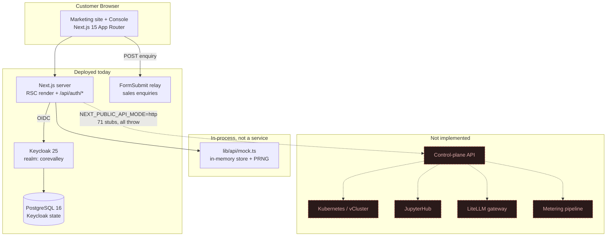
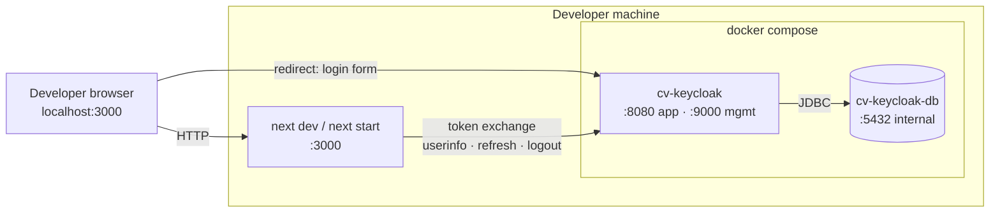

# 01 — Platform Architecture

**Owner:** Kaustuv · **Support:** Abhigyan
**Status:** ⚠️ **Partial** — the presentation tier and identity tier are built and
running. The control-plane API tier does not exist; the portal is served by an
in-memory mock behind a compile-enforced interface.

---

## 1. System context

What physically exists today, and what the code is *shaped for* but does not yet
talk to.



Dashed red boxes are **not built**. The dashed edge from Next.js to the
control-plane API is the `NEXT_PUBLIC_API_MODE=http` path: it compiles, type-checks
and is wired end to end, but every method throws `NotImplementedError`.

### Deployed component inventory

| Component | Technology | Where it runs | State |
|---|---|---|---|
| Marketing site | Next.js 15.5.25 App Router, RSC | Node server, or static `out/` | Stateless |
| Customer console | Next.js App Router, RSC + client islands | Same Node server | Session cookie only |
| Auth handler | NextAuth.js v5 (`5.0.0-beta.32`) / `@auth/core` `0.41.3` | `/api/auth/[...nextauth]` | JWT session cookie |
| Identity provider | Keycloak `25.0` (`quay.io/keycloak/keycloak:25.0`) | Docker, port 8080 | PostgreSQL |
| Identity database | PostgreSQL `16-alpine` | Docker, volume `kc-pgdata` | Durable |
| Sales enquiry relay | FormSubmit (third-party SaaS) | External | None |
| Domain data | `lib/api/mock.ts` | In the Next.js process | In-memory, per-process |

---

## 2. Runtime topology (local / beta)



Two things to note about this topology:

1. **The browser and the Next.js server both talk to Keycloak, over different
   channels.** The browser is redirected to the authorization endpoint; the server
   performs the back-channel token exchange with the client secret. `KEYCLOAK_ISSUER`
   must therefore resolve *identically* from both — which is why the local setup
   uses `localhost:8080` rather than the Docker-internal hostname `keycloak:8080`.
   Using the internal hostname breaks the browser redirect; using only the external
   hostname breaks nothing locally but will need split-horizon DNS or an issuer
   override in a containerised deployment.

2. **There is no reverse proxy in the local topology.** Ports are bound directly.
   Any production deployment adds a proxy, at which point `trustHost: true` in
   `lib/auth.ts` becomes load-bearing (see [09](09-security-and-compliance.md)).

---

## 3. Repository topology

```
app/
  (marketing)/          9 public route files — statically prerendered
  (portal)/portal/      15 console route files
  api/auth/[...nextauth]/route.node.ts    NextAuth handler (server builds only)
  layout.tsx            root layout — fonts, metadata, <AuthProvider>
  globals.css           design-system bridge (load-bearing, see 06)
components/
  ui/                   11 design-system primitives (9 server, 2 client)
  layout/               header, footer, portal shell, logo, auth modal, auth provider
  marketing/            hero canvas, latency mesh, pricing tables, contact form
  portal/               status pills, meters, launch wizard, charts, live pod panel
lib/
  auth.ts               NextAuth v5 configuration — provider selection, claim mapping
  api/
    client.ts           CoreValleyClient interface (71 methods) + getClient()
    mock.ts             in-memory implementation (~52 KB)
    http.ts             REST implementation — 71 stubs, all throw
    types.ts            domain model
    synthetic.ts        deterministic PRNG and time-series generators
  catalog.ts            ⚠ 24 placeholder NPR rates — single edit point
  money.ts              integer-paisa arithmetic, NPR/USD formatting, VAT
  format.ts             display formatters
  mesh-basemap.ts       generated map data — do not hand-edit
keycloak/
  corevalley-realm.json realm export, imported on container start
types/
  next-auth.d.ts        module augmentation adding role/org to Session and JWT
middleware.ts           gates /portal/:path*
docker-compose.yml      Keycloak + Postgres
design_system/          read-only source of truth (also a Claude skill folder)
reference/              the previous static site, archived
```

### Enforced boundaries

| Boundary | Enforced by | Failure mode if violated |
|---|---|---|
| `app/` and `components/` must not import from `design_system/` | ESLint rule | Design tokens get restated in two places and drift |
| `mock.ts` and `http.ts` must have identical signatures | `satisfies CoreValleyClient` on both | Screens compile against one implementation and break on the other |
| No synchronous reads in the client interface | Interface design — every method returns `Promise` | Interface becomes unimplementable over HTTP |
| `design_system/` must not move | Carries `SKILL.md` frontmatter | Skill discovery breaks |

---

## 4. Rendering model

The App Router split is the primary architectural decision in the presentation
tier, and it is not documented anywhere else.

### Server components fetch; client components subscribe

Every portal page is an `async` **server component** that calls `getClient()` and
awaits its data during render. Client components are used only where interactivity
or a live subscription is genuinely required.

```tsx
// app/(portal)/portal/page.tsx — server component, no "use client"
export default async function OverviewPage() {
  const cv = getClient();
  const [org, pods, spend, capacity, usage, audit, clusters] = await Promise.all([
    cv.getOrganization(),
    cv.listPods(),
    cv.getCurrentSpend(),
    cv.listCapacity(),
    cv.getUsageSeries({ meterIds: ["gpu_seconds"], window: "hour" }),
    cv.listAuditLog({ limit: 6 }),
    cv.listVClusters(),
  ]);
  ...
}
```

All seven calls are issued concurrently through `Promise.all`. This is the
standard pattern across the console — sequential awaits would serialise the
round trips once a real backend is behind them.

### The client-component inventory

There are deliberately few. Each one exists for a stated reason:

| Component | Why it must be a client component |
|---|---|
| `components/layout/portal-shell.tsx` | Owns mobile drawer state; calls `useSession()` and `signOut()` |
| `components/layout/site-header.tsx` | Owns drawer + auth-modal state; calls `useSession()` |
| `components/layout/auth-modal.tsx` | Native `<dialog>` imperative API; calls `signIn()` |
| `components/layout/auth-provider.tsx` | Wraps `<SessionProvider>`; holds React context |
| `components/portal/launch-form.tsx` | Multi-step form state; re-estimates on every change |
| `components/portal/pod-live.tsx` | Holds two live subscriptions |
| `components/marketing/contact-form.tsx` | Form submission + fallback logic |
| `components/marketing/hero-canvas.tsx`, `sovereign-mesh.tsx` | Canvas animation |
| `components/ui/tabs.tsx`, `switch.tsx` | Interactive primitives |

Everything else — including `UsageChart`, which renders inline SVG — is a server
component with zero client JavaScript.

### Determinism is a hard requirement

The mock generates its data from a seeded PRNG (`lib/api/synthetic.ts`), not from
`Math.random()` or live `Date.now()`. This is not a stylistic choice:

```ts
/** Current time, floored to the hour so SSR and hydration agree. */
export function now(): number {
  const HOUR = 3600_000;
  return Math.floor(Date.now() / HOUR) * HOUR;
}
```

A server render and the client render that hydrates it must produce byte-identical
markup. Any non-determinism — an unquantised timestamp, an unseeded random, a
relative time string — produces a React hydration mismatch. `lib/format.ts`
carries the same constraint in its comments:

> Absolute UTC timestamp. Deliberately not "3 minutes ago": relative times
> computed during SSR disagree with the client render and cause hydration
> mismatches.

Live drift is applied **only** by the mock's `subscribe*` timers, which start
after mount and therefore cannot affect hydration.

### ⚠️ Known discrepancy: portal pages are statically prerendered

The repository README states the portal is `force-dynamic`. **It is not.** No
route in `app/` exports `dynamic` or `revalidate`:

```bash
$ grep -rn "export const dynamic\|export const revalidate" app/
# (no matches)
```

The production build confirms every portal route is prerendered as static:

```
├ ○ /portal                               1.5 kB         116 kB
├ ○ /portal/audit                        1.49 kB         112 kB
├ ● /portal/pods/[id]                    1.39 kB         175 kB
○  (Static)   prerendered as static content
●  (SSG)      prerendered as static HTML (uses generateStaticParams)
```

**Why this is currently harmless:** the mock is deterministic, so a build-time
render and a request-time render produce the same output.

**Why it becomes a correctness bug the moment a real backend lands:** every
console page would serve build-time data to every tenant, including another
tenant's data. `app/(portal)/portal/pods/[id]/page.tsx` even hard-codes six pod
IDs in `generateStaticParams()`.

**Required fix before wiring `NEXT_PUBLIC_API_MODE=http`:** add
`export const dynamic = "force-dynamic"` to `app/(portal)/portal/layout.tsx` and
delete the `generateStaticParams()` in the pod detail route. Tracked in
[10](10-implementation-status.md).

---

## 5. Route inventory

### Marketing — public, statically prerendered

| Route | Notes |
|---|---|
| `/` | Homepage — animated hero canvas, latency mesh |
| `/products`, `/products/[slug]` | 4 static params: `gpu-pods`, `jupyterhub`, `model-endpoints`, `dedicated` |
| `/use-cases` | |
| `/company` | |
| `/pricing` | NPR/USD and hourly/monthly toggles |
| `/docs`, `/docs/[...slug]` | 3 static params: `quickstart`, `cli`, `api` |
| `/contact` | Sales enquiry form |

### Console — gated by `middleware.ts`

`/portal` · `/portal/pods` · `/portal/pods/new` · `/portal/pods/[id]` ·
`/portal/jupyter` · `/portal/models` · `/portal/dedicated` · `/portal/clusters` ·
`/portal/network` · `/portal/keys` · `/portal/usage` · `/portal/billing` ·
`/portal/audit` · `/portal/security` · `/portal/settings`

All console routes carry `robots: { index: false, follow: false }` via
`app/(portal)/portal/layout.tsx`.

### API

| Route | Methods | Notes |
|---|---|---|
| `/api/auth/[...nextauth]` | `GET`, `POST` | Only server-side API surface in the repo. File is `route.node.ts` — see [07](07-build-deploy-and-environments.md). |

---

## 6. Technology inventory

| Layer | Choice | Version | Rationale |
|---|---|---|---|
| Framework | Next.js App Router | 15.5.25 | RSC lets the console fetch on the server without shipping a data layer to the browser |
| UI runtime | React | 19.2.0 | |
| Language | TypeScript | 5.9.2 | `strict` **plus** `noUncheckedIndexedAccess` — array indexing returns `T \| undefined` |
| Styling | Tailwind CSS v4 | 4.1.14 | Bridged onto existing design-system CSS tokens; no value restated |
| Variants | `class-variance-authority` | 0.7.1 | |
| Class merge | `clsx` + `tailwind-merge` | 2.1.1 / 3.3.1 | |
| Icons | `@phosphor-icons/react` | 2.1.10 | Imported from `/dist/ssr` to stay server-renderable |
| Auth | `next-auth` (Auth.js v5) | 5.0.0-beta.32 | Native Keycloak OIDC provider; Edge-compatible JWT sessions |
| Auth core | `@auth/core` | 0.41.3 | Transitive |
| IdP | Keycloak | 25.0 | |
| IdP datastore | PostgreSQL | 16-alpine | |

**No charting library, no animation library, no CSS-in-JS, no state-management
library.** Charts are hand-rolled inline SVG (`components/portal/usage-chart.tsx`);
animation is canvas and CSS; state is React primitives.

---

## 7. Data flow: a console page render

```mermaid
sequenceDiagram
    participant B as Browser
    participant M as middleware.ts
    participant P as Page (RSC)
    participant C as getClient()
    participant S as mock store
    participant CL as Client island

    B->>M: GET /portal/pods/pod_9f3a21
    M->>M: auth() — decode session JWT
    alt no session
        M-->>B: 302 /?signin=1&callbackUrl=…
    end
    M->>P: forward
    P->>C: getClient()
    Note over C: NEXT_PUBLIC_API_MODE inlined<br/>at build; dead branch eliminated
    C->>S: getPod / getPodLogs / getPodTelemetrySeries
    S-->>C: cloned plain objects
    C-->>P: resolved data
    P-->>B: streamed RSC payload + HTML
    B->>CL: hydrate PodLivePanel
    CL->>C: subscribePod + subscribePodTelemetry
    C-->>CL: setInterval ticks every 2s
```

`getClient()` selects the implementation:

```ts
export function getClient(): CoreValleyClient {
  return process.env.NEXT_PUBLIC_API_MODE === "http" ? httpClient : mockClient;
}
```

Because `NEXT_PUBLIC_API_MODE` is inlined at build time, the unused branch is dead
code and is eliminated from the production bundle. Static imports are used rather
than `require()` because `require` is unavailable in client bundles.

The mock returns **cloned** objects (`clone()` = `structuredClone`-equivalent deep
copy), never live references into its store. This preserves the same semantics a
real HTTP client would have, so no screen can accidentally depend on mutating a
returned object.

---

## 8. Architectural decision record

<details>
<summary><b>ADR-001 — Write the HTTP client before the mock</b></summary>

<br>

`lib/api/http.ts` was written first, and every method still throws
`NotImplementedError`. It is kept in lockstep with `client.ts` deliberately.

**Decision:** maintain a complete, non-functional REST implementation alongside
the mock.

**Rationale:** it proves the interface is implementable over plain HTTP. An
interface designed against an in-memory store tends to grow synchronous reads,
live object references and chatty call patterns that cannot survive a network
boundary. Both files end with `satisfies CoreValleyClient`, so signature drift is
a compile error rather than a runtime surprise.

**Cost:** 71 stub methods to maintain. Cheap — they are one line each.
</details>

<details>
<summary><b>ADR-002 — <code>subscribe*</code> returns <code>Unsubscribe</code>, not an <code>EventSource</code></b></summary>

<br>

```ts
export type Unsubscribe = () => void;
subscribePod(id: string, cb: (pod: Pod) => void): Unsubscribe;
```

**Decision:** the transport is not part of the contract.

**Rationale:** the mock uses `setInterval`; a real backend will use SSE or a
WebSocket. `components/portal/pod-live.tsx` calls both subscriptions and returns
their unsubscribers from a `useEffect` cleanup. Changing the transport changes no
screen.
</details>

<details>
<summary><b>ADR-003 — Money is integer paisa, everywhere</b></summary>

<br>

**Decision:** `type Paisa = number`, always an integer. Formatting happens only at
the render edge.

**Rationale:** per-second GPU metering aggregated over a month is roughly 2.6
million additions. IEEE-754 drift across that many operations is measured in
rupees, not paisa. Full treatment in [05](05-billing-and-metering.md).
</details>

<details>
<summary><b>ADR-004 — One auth-mode flag, derived server-side</b></summary>

<br>

**Decision:** the auth mode is derived once on the server from `KEYCLOAK_ISSUER`
and passed to the client through React context, not through a second
`NEXT_PUBLIC_AUTH_MODE` variable.

**Rationale:** two environment variables meaning the same thing eventually
disagree, producing a UI that offers SSO while the server has only the mock
provider. Full treatment in [03](03-keycloak-identity.md).
</details>

---

## 9. What this architecture does not have

Stated plainly so nobody plans against a capability that is absent.

| Absent | Consequence today |
|---|---|
| Control-plane API | All console data is in-memory and per-process. Restarting the server resets it. |
| Database for domain data | No persistence of pods, projects, keys, invoices. |
| Kubernetes / vCluster integration | "Launch pod" runs a `setTimeout` state machine, not a scheduler. |
| Metering pipeline | Usage is derived from a PRNG at read time, not from meter events. |
| Per-tenant isolation | One organisation fixture (`ORG`), one realm, no tenant dimension in any query. |
| Status page | Not built. |
| Structured logging, metrics, tracing | Not built. No telemetry beyond Next.js build output and container logs. |
| Rate limiting, WAF, CSP | Not configured. |
| Automated tests | No test runner, no test files. Verification is manual — see [08](08-operations-runbook.md). |
