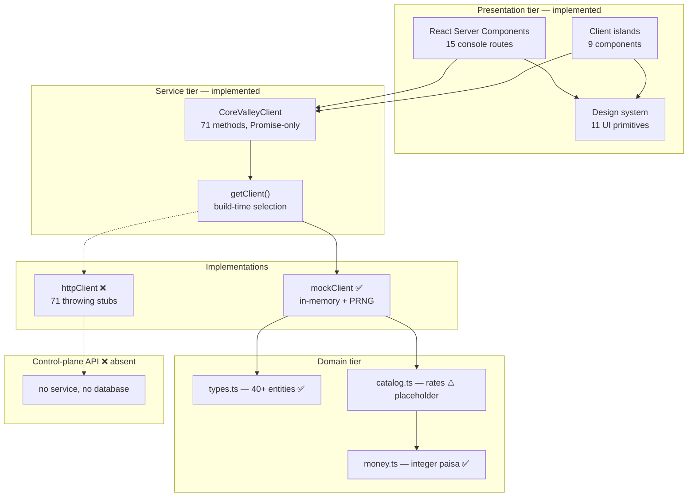
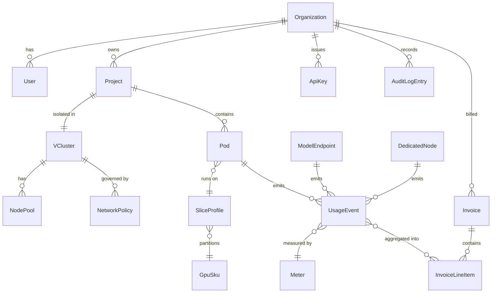
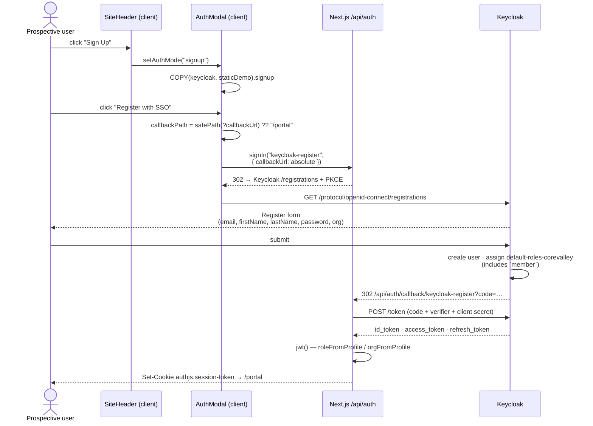
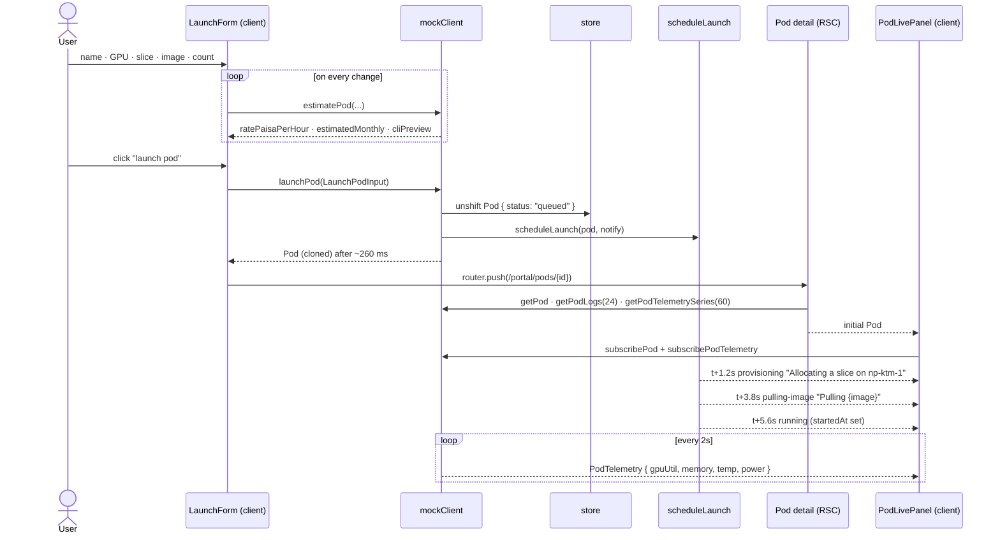
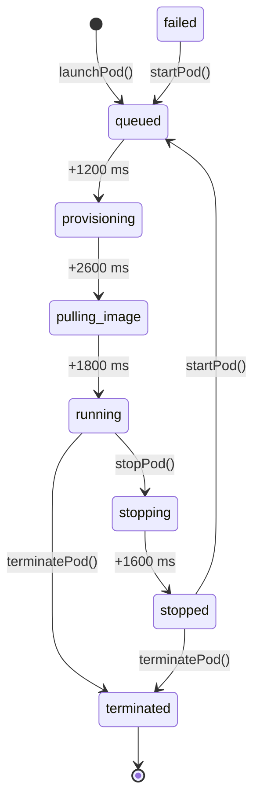

# 02 — Web Portal & Customer Control Plane

**Owner:** Kaustuv · **Support:** Abhigyan

**Status:** ⚠️ **Partial**

| Sub-component | Status | Note |
|---|---|---|
| Portal frontend | ✅ Implemented | 15 console routes, 9 marketing routes, full design-system integration |
| Portal backend | ❌ Not implemented | No control-plane service exists. `lib/api/http.ts` holds 71 stubs that throw. |
| Service layer / data access | ✅ Implemented | `CoreValleyClient` interface + in-memory `mockClient` |
| Database schema | ❌ Not implemented | No database for domain data. The domain *model* exists in `lib/api/types.ts`. |
| Support Desk integration | ⚠️ Partial | Sales enquiry form posting to FormSubmit. Not a ticketing system — see §7. |
| Status Page | ❌ Not implemented | No code, no third-party integration, no route. |

---

## 1. Architecture and tech stack

### 1.1 Tier breakdown



### 1.2 Frontend framework

| Concern | Choice | Detail |
|---|---|---|
| Framework | Next.js 15.5.25, App Router | Route groups `(marketing)` and `(portal)` share the root layout but not the chrome |
| Rendering | React Server Components by default | Client components are opt-in and enumerated in [01 §4](01-platform-architecture.md#4-rendering-model) |
| Language | TypeScript 5.9.2 | `strict` + `noUncheckedIndexedAccess` + `verbatimModuleSyntax` |
| Styling | Tailwind CSS v4.1.14 | Bridged onto design-system CSS custom properties — see [06](06-design-system-and-frontend.md) |
| Variants | `class-variance-authority` 0.7.1 | |
| Icons | `@phosphor-icons/react` 2.1.10 | Imported from `/dist/ssr` so `Icon` stays a server component |

### 1.3 State management

**There is no state-management library.** No Redux, Zustand, Jotai, React Query or
SWR. State is partitioned by lifetime, and each partition has exactly one
mechanism:

| State | Mechanism | Lives in | Lifetime |
|---|---|---|---|
| Server data (pods, invoices, usage…) | `await getClient().method()` in an RSC | Not held client-side at all | One render |
| Auth session | `useSession()` from `next-auth/react` | `<SessionProvider>` | Cookie-backed, 8 h |
| Auth mode (keycloak / mock / static) | React context, `useAuthMode()` | `components/layout/auth-provider.tsx` | Process lifetime |
| Form state (launch wizard, contact) | `React.useState` | The client component | Component mount |
| Live pod status + telemetry | `useState` fed by `subscribe*` callbacks | `components/portal/pod-live.tsx` | Component mount |
| UI chrome (drawers, modals) | `React.useState` | `portal-shell`, `site-header` | Component mount |
| Cross-render invalidation | `router.refresh()` | after a mutation | — |

**Why no data-fetching library:** with RSC, server data never crosses into client
state. There is no cache to invalidate, no stale-while-revalidate window and no
serialisation boundary to manage. After a mutation, `router.refresh()` re-runs the
server component and streams a fresh RSC payload:

```tsx
// components/portal/pod-live.tsx
async function act(fn: () => Promise<unknown>) {
  setBusy(true);
  await fn();
  setBusy(false);
  router.refresh();   // re-run the RSC; no client cache to reconcile
}
```

### 1.4 Backend service layers

The layering that exists today:

| Layer | File | Responsibility |
|---|---|---|
| **Contract** | `lib/api/client.ts` | 71-method interface. Promise-only, no live object references. Both implementations `satisfies` it. |
| **Selection** | `lib/api/client.ts` → `getClient()` | Build-time branch on `NEXT_PUBLIC_API_MODE`; dead branch eliminated |
| **Mock implementation** | `lib/api/mock.ts` (~52 KB) | In-memory store, deterministic derivation, timer-driven state machines |
| **Transport implementation** | `lib/api/http.ts` | 71 stubs. `NotImplementedError` carries the method name and remediation text. |
| **Domain model** | `lib/api/types.ts` | 40+ interfaces and union types |
| **Pricing** | `lib/catalog.ts` | Rate tables + lookups. ⚠ 24 placeholder rates. |
| **Money** | `lib/money.ts` | Integer-paisa arithmetic, NPR/USD formatting, 13 % VAT |
| **Determinism** | `lib/api/synthetic.ts` | mulberry32 PRNG, FNV-1a hash, hour-quantised clock, usage curve generator |

### 1.5 Database schema

❌ **No database exists for domain data.** The only database in the stack is
PostgreSQL backing Keycloak, whose schema is Keycloak's own and is not managed by
this repository.

The domain *model* that a schema would have to satisfy is fully specified in
`lib/api/types.ts` and reproduced in
[04 — Data Model & API Contract](04-data-model-and-api-contract.md). Entity
relationships as modelled today:



**Critical modelling note carried in the type definitions:** MIG and HAMi are
different products and must not be collapsed into one "slice" concept.

```ts
// lib/api/types.ts
export type SliceIsolation = "exclusive" | "mig" | "hami";
```

> MIG partitions a GPU in hardware: each slice gets dedicated SMs, L2 and memory,
> with real fault isolation between tenants. HAMi slices in software via the
> device plugin: memory limits and a compute percentage, scheduled onto a shared
> card. Cheaper, denser, but tenants are **NOT** fault-isolated from each other.

`SliceProfile.faultIsolated` is a first-class field, surfaced in the launch wizard
as a `not fault-isolated` warning, and HAMi is priced below the comparable MIG
tier because of it. Any schema that loses this distinction is wrong.

---

## 2. Workflow — User sign-up

**Status:** ✅ Implemented (via Keycloak self-registration) · **Caveat:** account
creation lands the user in one shared realm with the `member` role. There is no
organisation provisioning, no invite flow and no approval step.



### Narrative breakdown

1. **Entry.** `components/layout/site-header.tsx` renders **Sign In** / **Sign Up**
   only when `useSession().status !== "authenticated"`; otherwise it renders a
   **Console** link. It also auto-opens the modal when the URL carries `?signin=1`
   or `?error=`, which is how a middleware redirect explains itself.

2. **The modal collects nothing.** `components/layout/auth-modal.tsx` has no email
   field and no password field. Registration is Keycloak's job.

3. **Provider selection.** Sign-up uses the `keycloak-register` provider entry,
   whose authorization URL is Keycloak's `/protocol/openid-connect/registrations`
   endpoint — a sibling of the authorization endpoint, not a parameter on it.
   Detail in [03 §3](03-keycloak-identity.md).

4. **`callbackUrl` is absolutised.** Auth.js silently discards a *relative*
   `callbackUrl`, so the modal converts it and rejects anything that is not a
   same-site path:

   ```ts
   function safePath(value: string | null): string | null {
     if (!value) return null;
     if (!value.startsWith("/") || value.startsWith("//")) return null;
     return value;
   }
   // …
   callbackUrl: new URL(callbackPath, window.location.origin).href
   ```

   `//evil.com` is a protocol-relative URL, not a path — rejecting it closes an
   open-redirect.

5. **Role and organisation assignment.** `default-roles-corevalley` is a composite
   that includes `member`, verified against the running realm:

   ```
   $ GET /admin/realms/corevalley/roles/default-roles-corevalley/composites
   manage-account, uma_authorization, member, view-profile, offline_access
   ```

   The `org` attribute is declared in the realm's user profile, so it appears on
   the registration form and is captured at sign-up.

### Gaps in this workflow

| Gap | Impact |
|---|---|
| No organisation provisioning | Every user joins the same realm. `Organization` is a single hard-coded fixture in `mock.ts`. |
| No invite flow | `inviteUser()` exists on the interface and in the mock; it is not wired to Keycloak. |
| No approval / allow-listing | `registrationAllowed: true` means anyone can self-register. |
| No email verification | `verifyEmail: false`; no SMTP configured, so password reset cannot deliver either. |

---

## 3. Workflow — Resource catalogue browsing

**Status:** ✅ Implemented — served entirely from `lib/catalog.ts`, a compile-time
constant. ⚠ All rates are placeholders.

```mermaid
sequenceDiagram
    participant B as Browser
    participant P as Page (RSC)
    participant C as mockClient
    participant CAT as lib/catalog.ts

    B->>P: GET /portal/pods/new
    P->>C: Promise.all([listGpuSkus, listSliceProfiles, listProjects])
    C->>CAT: GPU_SKUS · SLICE_PROFILES
    CAT-->>C: 5 SKUs · 11 slice profiles
    C-->>P: cloned arrays (~90 ms simulated latency)
    P-->>B: HTML + RSC payload; LaunchForm hydrates
    B->>C: estimatePod(profileId, gpuCount, skuId, regionId, name)
    C->>CAT: rateForProfile(profileId)
    CAT-->>C: HourlyRate { paisaPerHour, paisaPerSecond, placeholder: true }
    C-->>B: PodEstimate incl. ratePlaceholder + cliPreview
```

### Catalogue contents (as-built)

| Table | Entries | Notes |
|---|---|---|
| `GPU_SKUS` | 5 | H200 and H100 `available`; RTX PRO 6000 Blackwell, L40S, L4 `coming-soon` |
| `REGIONS` | 1 live (`np-ktm-1`, Kathmandu) | |
| `SLICE_PROFILES` | 11 | Mix of `exclusive`, `mig`, `hami` |
| `GPU_HOURLY` | 13 hourly rates | |
| `JUPYTER_RATES` | 3 spawner profiles | `jhub-cpu`, `jhub-1g`, `jhub-2g` |
| `TOKEN_RATES` | 4 endpoints | llama-3.3-70b, qwen2.5-72b, deepseek-v3, mistral-small-3.1-24b |
| `DEDICATED_MONTHLY` | 3 node shapes | 8× H200 bare metal, 8× H100 bare metal, 4× H200 VM |
| `STORAGE_RATES` | 2 classes | `network-ssd`, `nvme-local` |
| `EGRESS_RATE` | 1 | 500 GB/month free allowance |

### Filtering rules encoded in the UI

- Only `status === "available"` SKUs are offered in the launch wizard.
- Slice profiles are filtered to the selected SKU; when the SKU changes and the
  selected profile becomes invalid, it resets to the first valid profile.
- `gpuCount` is only settable for `isolation === "exclusive"` profiles (whole
  cards, 1–8). Sliced profiles are pinned to one instance per pod.

```tsx
// components/portal/launch-form.tsx
React.useEffect(() => {
  if (!skuProfiles.some((p) => p.id === profileId)) {
    setProfileId(skuProfiles[0]?.id ?? "");
  }
}, [skuProfiles, profileId]);
```

---

## 4. Workflow — One-click infrastructure launch

**Status:** ⚠️ **Partial** — the wizard, estimation, state machine, live telemetry
and lifecycle controls are fully implemented against the mock. **No scheduler,
Kubernetes API or container runtime is involved.** Pod transitions are `setTimeout`
calls.

### 4.1 End-to-end sequence



### 4.2 The estimate

`estimatePod()` is a pure catalogue lookup — cheap enough to run on every
keystroke, and honest about being a placeholder:

```ts
const rate = rateForProfile(input.profileId);
const profile = profileById(input.profileId);
const perHour = rate.paisaPerHour * input.gpuCount;
const flag = profile.isolation === "exclusive"
  ? `--gpu ${sku.shortName} --count ${input.gpuCount}`
  : `--gpu ${sku.shortName} --slice ${profile.label.replace(/\s/g, "")}`;
return {
  ratePaisaPerHour: perHour,
  ratePaisaPerSecond: rate.paisaPerSecond * input.gpuCount,
  estimatedMonthlyPaisa: perHour * 730,          // 730 h = 1 month
  minimumBillableSeconds: rate.minimumBillableSeconds,   // 60
  ratePlaceholder: rate.placeholder,             // → renders the warning badge
  cliPreview: `corevalley pods launch --name ${input.name || "my-pod"} ${flag} --region ${input.regionId}`,
};
```

`paisaPerSecond` is **derived** from `paisaPerHour` in the catalogue rather than
stated separately, so the displayed hourly rate and the metered per-second rate
cannot drift.

The launch form debounces nothing but cancels in flight:

```tsx
React.useEffect(() => {
  if (!profileId) return;
  let cancelled = false;
  getClient().estimatePod({ ... }).then((e) => { if (!cancelled) setEstimate(e); });
  return () => { cancelled = true; };
}, [profileId, count, skuId, name, exclusive]);
```

### 4.3 The pod state machine



Implemented as:

```ts
function scheduleLaunch(pod: Pod, notify: () => void) {
  const steps: [PodStatus, string | null, number][] = [
    ["provisioning",  "Allocating a slice on np-ktm-1", 1200],
    ["pulling-image", `Pulling ${pod.image}`,           2600],
    ["running",       null,                             1800],
  ];
  let acc = 0;
  for (const [status, detail, ms] of steps) {
    acc += ms;
    setTimeout(() => {
      const target = store.pods.find((p) => p.id === pod.id);
      if (!target || target.status === "terminated") return;   // terminate wins
      target.status = status;
      target.statusDetail = detail;
      if (status === "running") target.startedAt = new Date().toISOString();
      notify();
    }, acc);
  }
}
```

`PodStatus` has eight members; `failed` is reachable in the type and handled in the
UI (`startPod()` accepts a `failed` pod) but the mock never produces it. A real
scheduler will.

### 4.4 Pod identity and derived fields

| Field | Derivation |
|---|---|
| `id` | `pod_` + FNV-1a hash of `name + podCounter`, hex, 6 chars |
| `vclusterId` | Looked up from the selected project; falls back to `vc_research` |
| `skuId` | Taken from the **profile**, not the form — the profile is authoritative |
| `ratePaisaPerHour` | `rateForProfile(profileId).paisaPerHour × gpuCount` |
| `sshCommand` | `ssh {name}@np-ktm-1.corevalley.ai` |
| `exposedPorts` | `input.exposedPorts ?? [8888]` |
| `billableSeconds`, `costToDatePaisa` | Initialised to 0; billing starts at `running` |

### 4.5 Live telemetry subscription

```ts
subscribePodTelemetry: (id, cb) => {
  let tick = 0;
  const timer = setInterval(() => {
    const pod = store.pods.find((p) => p.id === id);
    if (pod) cb(telemetryFor(pod, tick++));
  }, 2000);
  return () => clearInterval(timer);
}
```

Consumed by `PodLivePanel`, which returns both unsubscribers from its effect
cleanup so nothing leaks on navigation:

```tsx
React.useEffect(() => {
  const cv = getClient();
  const offPod = cv.subscribePod(initial.id, setPod);
  const offTel = cv.subscribePodTelemetry(initial.id, setTelemetry);
  return () => { offPod(); offTel(); };
}, [initial.id]);
```

---

## 5. API contracts

### 5.1 What exists today

The portal has exactly **one** HTTP API surface: the NextAuth handler.

| Endpoint | Method | Auth | Response |
|---|---|---|---|
| `/api/auth/providers` | `GET` | none | Registered providers |
| `/api/auth/csrf` | `GET` | none | `{ csrfToken }` + sets `authjs.csrf-token` |
| `/api/auth/signin/:provider` | `POST` | CSRF token | `302` to the IdP authorization URL |
| `/api/auth/callback/:provider` | `GET` | state + PKCE verifier | `302` to `callbackUrl`; sets session cookie |
| `/api/auth/session` | `GET` | session cookie | `Session` JSON or `null` |
| `/api/auth/signout` | `POST` | CSRF token | `302`; clears cookie; triggers federated logout |

Verified live:

```bash
$ curl -s http://localhost:3000/api/auth/providers
{"keycloak":{"id":"keycloak","name":"Keycloak","type":"oidc",
  "signinUrl":"http://localhost:3000/api/auth/signin/keycloak",
  "callbackUrl":"http://localhost:3000/api/auth/callback/keycloak"},
 "keycloak-register":{"id":"keycloak-register","name":"CoreValley (register)","type":"oidc",
  "signinUrl":"http://localhost:3000/api/auth/signin/keycloak-register",
  "callbackUrl":"http://localhost:3000/api/auth/callback/keycloak-register"}}
```

```jsonc
// GET /api/auth/session — authenticated
{
  "user": {
    "name": "Kaustuv Bhattarai",
    "email": "kaustuv@corevalley.ai",
    "image": null,
    "id": "6b6db9a6-84ac-451e-af09-fbaed1882e03",   // Keycloak `sub`
    "role": "admin",
    "org": "CoreValley"
  },
  "expires": "2026-09-05T03:21:38.744Z",
  "accessToken": "eyJhbGciOiJSUzI1NiIsInR5cCIgOiAiSldUIiwia2lkIiA6ICJBZE1w…"
}
```

### 5.2 The domain contract

Domain operations are **not** HTTP endpoints today. They are the 71 methods of
`CoreValleyClient`, which is the specification a control-plane API must satisfy.
The full method list, the proposed REST mapping and payload shapes are in
[04 — Data Model & API Contract](04-data-model-and-api-contract.md).

Contract invariants, enforced by the interface itself:

| Invariant | Enforced how | Why |
|---|---|---|
| Every method returns a `Promise` | Interface signature | No synchronous read can survive a network boundary |
| No live object references returned | `mock.ts` deep-clones on every return | A screen must not be able to mutate the store |
| Subscriptions return `Unsubscribe`, not a transport | `export type Unsubscribe = () => void` | Swapping `setInterval` for SSE changes no screen |
| Both implementations stay in sync | `satisfies CoreValleyClient` on both objects | Drift becomes a compile error |

### 5.3 Error-handling strategy

**As-built.** Three distinct mechanisms, no unified error envelope yet.

| Surface | Mechanism | Detail |
|---|---|---|
| Unimplemented transport | `NotImplementedError` | Carries the method name and the remediation |
| Mock domain errors | `throw new Error(...)` | `podOrThrow()`, `"key not found"`, `"server not found"` |
| Catalogue integrity | `throw new Error(...)` | `rateForProfile`, `skuById`, `profileById` throw on unknown IDs — fail loud, never silently price at zero |
| Route-level not-found | `notFound()` from `next/navigation` | `getPod(id).catch(() => null)` then `if (!pod) notFound()` |
| Render errors | `app/error.tsx` | App Router error boundary |
| Auth errors | Query param `?error=<code>` | Mapped to human text in `auth-modal.tsx` |

```ts
export class NotImplementedError extends Error {
  constructor(method: string) {
    super(
      `CoreValley HTTP client: ${method}() is not implemented yet. ` +
      "Set NEXT_PUBLIC_API_MODE=mock, or implement this method against the control-plane API.",
    );
    this.name = "NotImplementedError";
  }
}
```

Auth error codes handled in the modal:

| Code | Rendered message |
|---|---|
| `Configuration` | "The identity provider is misconfigured. Check KEYCLOAK_ISSUER and the client secret." |
| `AccessDenied` | "That account is not permitted to access this console." |
| `Verification` | "The sign-in link has expired. Please try again." |
| `OAuthCallbackError` | "The identity provider rejected the callback. Check the client's redirect URIs." |
| *(any other)* | "Sign-in failed. Please try again." |

**Gap.** There is no typed error union on the client interface, no HTTP status
mapping, no retry policy, no correlation ID and no user-facing error toast system.
A real backend needs all five. Tracked in [10](10-implementation-status.md).

---

## 6. Route protection

`middleware.ts` gates the console. Full treatment in
[03 §5](03-keycloak-identity.md).

```ts
export default auth((req) => {
  if (req.auth) return;
  const { pathname, search, origin } = req.nextUrl;
  const signInUrl = new URL("/", origin);
  signInUrl.searchParams.set("signin", "1");
  signInUrl.searchParams.set("callbackUrl", `${pathname}${search}`);
  return Response.redirect(signInUrl);
});

export const config = { matcher: ["/portal/:path*"] };
```

Verified:

```bash
$ curl -s -o /dev/null -w "%{http_code} -> %{redirect_url}\n" http://localhost:3000/portal
302 -> http://localhost:3000/?signin=1&callbackUrl=%2Fportal
```

**Authorisation, as opposed to authentication, is not enforced anywhere.**
`session.user.role` is mapped and typed but no route, page or action checks it.
A `member` sees exactly what an `admin` sees.

---

## 7. Support Desk integration

**Status:** ⚠️ **Partial** — a sales enquiry form, not a support desk.

There is no ticketing system, no SLA tracking, no authenticated in-console support
channel and no inbound routing. What exists is
`components/marketing/contact-form.tsx` on the public `/contact` route.

| Property | Value |
|---|---|
| Transport | `POST https://formsubmit.co/ajax/info@corevalley.ai` |
| Auth | None |
| Fields | `name*`, `email*`, `organisation`, `interest` (6 options), `gpu_hours`, `message*` |
| Control fields | `_subject`, `_template=table`, `_captcha=false`, `_honey` (honeypot) |
| Spam control | Hidden honeypot field only |
| Failure handling | On AJAX failure, mutates the form to a native `POST` and submits, so the message is not silently dropped |

```tsx
} catch {
  // Relay rejected the AJAX call — fall back to a native POST so the
  // message is still delivered rather than silently dropped.
  form.method = "POST";
  form.action = `https://formsubmit.co/${INBOX}`;
  form.submit();
}
```

**Risks to record.** Customer contact details and workload descriptions transit a
third-party relay with no DPA in place. `_captcha=false` disables FormSubmit's own
CAPTCHA, leaving only the honeypot. For a platform whose value proposition is
in-country data residency, this is a contradiction worth resolving before launch.

---

## 8. Status Page

**Status:** ❌ **Not implemented.** No route, no component, no third-party
integration, no uptime probe. The `region` pill in the portal sidebar is a static
literal:

```tsx
<span className="font-mono text-[11px] tracking-wide text-ink-300">np-ktm-1</span>
<span className="font-mono text-[10px] text-hydro">live</span>
```

It is chrome, not a health signal, and must not be read as one.

---

## 9. Operational runbook — control plane

### 9.1 Health checks

| Target | Command | Healthy response |
|---|---|---|
| Next.js server | `curl -s -o /dev/null -w "%{http_code}" http://localhost:3000/` | `200` |
| Auth handler | `curl -s http://localhost:3000/api/auth/providers` | JSON object with ≥ 1 provider |
| Route protection | `curl -s -o /dev/null -w "%{http_code}" http://localhost:3000/portal` | `302` |
| Session (with cookie) | `curl -s -b jar http://localhost:3000/api/auth/session` | `Session` JSON, not `null` |
| Keycloak | `curl -s -o /dev/null -w "%{http_code}" http://localhost:8080/realms/corevalley/.well-known/openid-configuration` | `200` |
| Containers | `docker compose ps` | both `healthy` |

❌ **There is no application health endpoint** (`/healthz`, `/readyz`). A load
balancer has nothing to probe but `/`.

### 9.2 Telemetry

❌ **None.** No structured logging, no metrics exporter, no distributed tracing,
no RUM, no error reporting. Available signals today:

| Signal | Source | Retention |
|---|---|---|
| Next.js request logs | stdout of `next dev` / `next start` | Process lifetime |
| Build output | `npm run build` | Per build |
| Keycloak server log | `docker compose logs keycloak` | Container lifetime |
| Keycloak admin events | Admin console → Events | Realm-configured |
| Browser console | DevTools | Session |

### 9.3 Common troubleshooting

| Symptom | Cause | Resolution |
|---|---|---|
| `ENOENT … .next/server/app/api/auth/[...nextauth]/route.js` | A static-export `.next` is being reused by the dev server | `rm -rf .next` and restart |
| `/api/auth/*` returns the 404 page | Same stale `.next`, or `NEXT_STATIC_EXPORT` still exported | Unset it, `rm -rf .next` |
| Console shows "Account" with no name | `useSession()` returned nothing — usually a missing `<AuthProvider>` | It is mounted in `app/layout.tsx`; confirm it wraps `{children}` |
| Sign-in succeeds but lands on `/` | A relative `callbackUrl` was passed to `signIn()` | Absolutise it — see §2 step 4 |
| `NotImplementedError: … getCurrentUser()` | `NEXT_PUBLIC_API_MODE=http` with no backend | Unset it (mock is the default) |
| Pod stuck in `queued` | `scheduleLaunch` timers lost — the mock store is per-process and does not survive a restart or an HMR module reload | Restart the dev server; relaunch the pod |
| Portal data reverts after restart | Expected — the store is in-memory | See [10](10-implementation-status.md) |
| `no catalog rate for profile <id>` | A `SliceProfile` exists without a matching `HourlyRate` | Add the rate to `GPU_HOURLY` in `lib/catalog.ts` |
| Hydration mismatch warning | Non-deterministic render — unquantised time or unseeded random | Use `now()` / `usageAt()` from `lib/api/synthetic.ts` |
| Portal shows build-time data | Portal routes are statically prerendered — see [01 §4](01-platform-architecture.md#4-rendering-model) | Add `force-dynamic` before wiring a real backend |

### 9.4 Deployment operations

```bash
npm run build && npm start        # production server build, port 3000
npm run lint                      # eslint
npm run typecheck                 # tsc --noEmit
```

> **Never run `npm run build` while a dev or production server is running.** Both
> write to `.next`, producing a split-brain build that fails at runtime with
> `Cannot find module './NNN.js'`. Recovery: `rm -rf .next && npm run build`.

### 9.5 Escalation

| Class | First responder | Escalate to |
|---|---|---|
| Portal frontend / build | Abhigyan | Kaustuv |
| Auth / Keycloak | Kaustuv | — |
| Pricing data | Kaustuv | Commercial (unassigned) |
