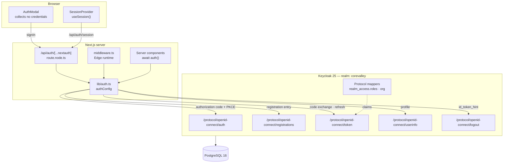
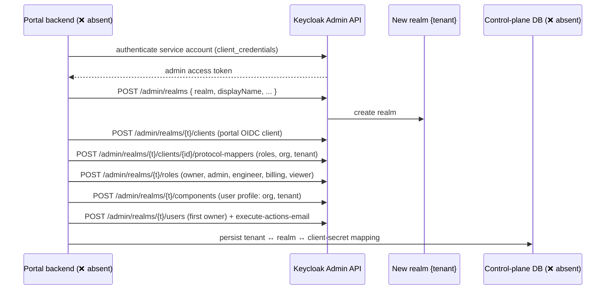
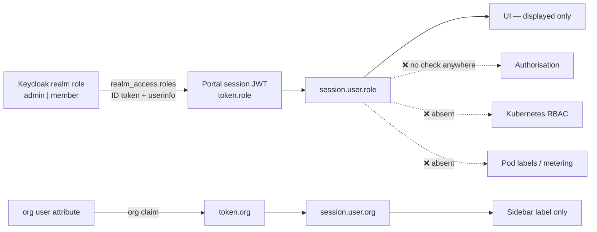

# 03 — Keycloak Authentication & Identity Integration

**Owner:** Kaustuv

**Status:** ⚠️ **Partial**

| Sub-component | Status | Note |
|---|---|---|
| Keycloak SSO — Web Portal | ✅ Implemented | Full OIDC authorization-code flow with PKCE, verified end to end |
| Realm, client, mappers, roles, seeded users | ✅ Implemented | Declarative import from `keycloak/corevalley-realm.json` |
| Claim → session mapping (`role`, `org`) | ✅ Implemented | Typed via module augmentation |
| Token refresh + federated logout | ✅ Implemented | Verified: SSO session actually terminates |
| Mock / static fallback modes | ✅ Implemented | Same session shape in all three modes |
| **Multi-tenant realm provisioning** | ❌ Not implemented | One shared realm. No Admin API automation exists. |
| **JupyterHub authenticator** | ❌ Not implemented | No JupyterHub deployment in this repo |
| **LiteLLM gateway JWT validation** | ❌ Not implemented | No gateway in this repo |
| **vCluster Kubernetes OIDC** | ❌ Not implemented | No Kubernetes in this repo |
| **Keycloak role → Kubernetes RBAC** | ❌ Not implemented | No RBAC manifests exist |
| **Tenant metadata in pod labels** | ❌ Not implemented | Pods are in-memory objects; no labels, no scheduler |
| **Authorisation enforcement in the portal** | ❌ Not implemented | `role` is mapped and typed but never checked |

> This document is the **architectural** treatment. The hands-on operator guide —
> setup, admin tasks, troubleshooting, verification scripts — is
> [`../KeyCloak_Readme.md`](../KeyCloak_Readme.md). The two are complementary;
> neither supersedes the other.

---

## 1. As-built identity architecture



### Configuration surface

| Artefact | Path | Role |
|---|---|---|
| Auth configuration | `lib/auth.ts` | Provider selection, claim mapping, refresh, federated logout |
| Request handler | `app/api/auth/[...nextauth]/route.node.ts` | `export const { GET, POST } = handlers` |
| Route guard | `middleware.ts` | Gates `/portal/:path*` |
| Client context | `components/layout/auth-provider.tsx` | `<SessionProvider>` + auth-mode context |
| Type augmentation | `types/next-auth.d.ts` | Adds `role` / `org` to `Session`, `User`, `JWT` |
| Realm definition | `keycloak/corevalley-realm.json` | Realm, client, mappers, roles, user profile, seeded users |
| Container definition | `docker-compose.yml` | Keycloak 25 + PostgreSQL 16 |
| Environment template | `.env.example` | Documented variables |

---

## 2. Multi-tenant realm strategy

### 2.1 Current state — ❌ single shared realm

There is **one** realm, `corevalley`, imported once at container start. Every user
lives in it. There is:

- no realm-per-customer provisioning,
- no Keycloak Admin API client in the codebase,
- no tenant identifier in the session beyond a free-text `org` string,
- no tenant dimension in any query in `lib/api/mock.ts` — the domain layer has a
  single hard-coded `Organization` fixture.

The **only** tenant-shaped signal that exists end to end is the `org` claim:

```ts
// lib/auth.ts — as-built
function orgFromProfile(profile: Record<string, unknown>): string | null {
  const org = profile["org"];
  if (typeof org === "string" && org.length > 0) return org;
  if (Array.isArray(org) && typeof org[0] === "string") return org[0];
  const email = profile["email"];
  if (typeof email === "string" && email.includes("@")) {
    return email.split("@")[1] ?? null;   // fallback: email domain
  }
  return null;
}
```

Verified against the running realm:

```
ID token claims for kaustuv@corevalley.ai
  sub                 6b6db9a6-84ac-451e-af09-fbaed1882e03
  realm_access.roles  [default-roles-corevalley, offline_access, member, admin, uma_authorization]
  org                 CoreValley
```

`org` is a display and grouping string. **It is not an authorisation boundary** —
nothing enforces it, and a user can be issued any value by an admin.

### 2.2 What "one realm per customer" would require

❌ **PROPOSED — none of this exists.** Recorded so the design decision is made
deliberately rather than by default.



**Decision points that must be settled before building this**, each with a real
cost:

| Decision | Options | Trade-off |
|---|---|---|
| Isolation model | Realm-per-tenant · Group-per-tenant in one realm · Organizations feature (KC 26+) | Realm-per-tenant gives the hardest isolation and per-tenant IdP federation, but the portal must resolve tenant → issuer **before** `signIn()`, which the current single-`KEYCLOAK_ISSUER` design cannot do |
| Issuer resolution | Subdomain (`acme.corevalley.ai`) · path prefix · email-domain lookup on a landing page | Subdomain is cleanest but requires wildcard TLS and per-tenant redirect URIs |
| Provider registration | One Auth.js provider per realm, built at request time · a single dynamic OIDC provider | Auth.js v5 builds `providers` at module scope. Dynamic issuers need a factory keyed on tenant, which the current `authConfig` constant does not support |
| Admin credentials | Dedicated service account per environment | A realm-creating credential is the highest-value secret in the platform |
| Scaling ceiling | Keycloak degrades with very large realm counts (JVM memory, cache) | Group-based tenancy scales further; realm-based isolates harder |

**Blocking prerequisite:** the portal has no backend, so there is nowhere to run
provisioning, and nowhere to persist the tenant ↔ realm mapping. Multi-tenancy is
gated on [02 §1.5](02-web-portal-control-plane.md) and
[04](04-data-model-and-api-contract.md), not on Keycloak.

### 2.3 The realm as it exists

Imported by `start-dev --import-realm` from a read-only mount, strategy
`IGNORE_EXISTING` — imported once, after which PostgreSQL is authoritative.

```yaml
# docker-compose.yml (excerpt)
command: ["start-dev", "--import-realm"]
volumes:
  - ./keycloak:/opt/keycloak/data/import:ro
```

| Realm setting | Value | Consequence |
|---|---|---|
| `registrationAllowed` | `true` | Anyone may self-register |
| `registrationEmailAsUsername` | `true` | One identifier |
| `resetPasswordAllowed` | `true` | Self-service reset (needs SMTP to deliver) |
| `loginWithEmailAllowed` | `true` | |
| `bruteForceProtected` | `true` | Lockout on repeated failures |
| `verifyEmail` | `false` | ⚠ Unverified addresses accepted |
| `sslRequired` | `none` | ⚠ Development only |
| `accessTokenLifespan` | `900` s | 15 min |
| `ssoSessionIdleTimeout` | `1800` s | 30 min |
| `ssoSessionMaxLifespan` | `36000` s | 10 h |

#### Client `corevalley-portal`

| Setting | Value |
|---|---|
| Access type | Confidential (`publicClient: false`) |
| Standard flow | Enabled (authorization code) |
| Direct access grants | Enabled — used by verification tooling only |
| PKCE | `S256`, enforced |
| Redirect URIs | `http://localhost:3000/api/auth/callback/keycloak`, `http://localhost:3000/*` |
| Web origins | `http://localhost:3000` |
| Post-logout redirect URIs | `http://localhost:3000/*` |

#### Protocol mappers

Both custom mappers set `id.token.claim`, `access.token.claim` **and**
`userinfo.token.claim`. This is not belt-and-braces — Auth.js builds its OIDC
profile from the ID token merged with the userinfo response. A mapper targeting
only the access token is **invisible** to the application, and `role` would
silently degrade to `member` for every user.

```json
{
  "name": "realm roles",
  "protocolMapper": "oidc-usermodel-realm-role-mapper",
  "config": {
    "multivalued": "true",
    "claim.name": "realm_access.roles",
    "id.token.claim": "true",
    "access.token.claim": "true",
    "userinfo.token.claim": "true",
    "jsonType.label": "String"
  }
}
```

```json
{
  "name": "organisation",
  "protocolMapper": "oidc-usermodel-attribute-mapper",
  "config": {
    "user.attribute": "org",
    "claim.name": "org",
    "id.token.claim": "true",
    "access.token.claim": "true",
    "userinfo.token.claim": "true",
    "jsonType.label": "String"
  }
}
```

#### Declarative user profile

Keycloak 24+ enables the declarative user profile, which **rejects attributes it
does not know about**. The realm therefore declares `org` explicitly and sets
`unmanagedAttributePolicy: "ENABLED"` so further attributes can be added without
another realm edit. Without this, the `org` attribute on the seeded users would be
silently dropped at import.

Confirmed by fetching the registration page — `org` renders as a real form field:

```bash
$ curl -s "…/protocol/openid-connect/registrations?client_id=corevalley-portal&…&code_challenge_method=S256" \
  | grep -oE 'name="(email|firstName|lastName|password|org)"' | sort -u
name="email"  name="firstName"  name="lastName"  name="org"  name="password"
```

#### Roles and seeded users

| Realm role | Meaning | Assignment |
|---|---|---|
| `admin` | Full control of the organisation's console | Explicit |
| `member` | Standard access | Composite of `default-roles-corevalley` → **granted to every new user automatically** |

```bash
$ GET /admin/realms/corevalley/roles/default-roles-corevalley/composites
manage-account, uma_authorization, member, view-profile, offline_access
```

| User | Password | Roles | `org` |
|---|---|---|---|
| `kaustuv@corevalley.ai` | `kaustuv123` | `admin`, `member` | `CoreValley` |
| `beta@corevalley.ai` | `beta123` | `member` | `Himal Analytics` |

⚠ These credentials and the client secret `corevalley-portal-dev-secret` are
committed to the repository. They are development-only. See
[09](09-security-and-compliance.md).

---

## 3. Provider configuration

### 3.1 Two provider entries, one client

Keycloak serves registration from `/protocol/openid-connect/registrations`, a
**sibling** of the authorization endpoint — not a parameter on it. (`kc_action` is
for required actions such as `UPDATE_PASSWORD`; there is no `kc_action=register`.)
So "Create an account" needs its own Auth.js provider entry:

```ts
providers: isKeycloakEnabled
  ? [
      Keycloak({
        clientId: KEYCLOAK_CLIENT_ID,
        clientSecret: KEYCLOAK_CLIENT_SECRET,
        issuer: KEYCLOAK_ISSUER,
        authorization: { params: { scope: "openid profile email" } },
      }),
      Keycloak({
        id: AUTH_REGISTER_PROVIDER_ID,          // "keycloak-register"
        name: "CoreValley (register)",
        clientId: KEYCLOAK_CLIENT_ID,
        clientSecret: KEYCLOAK_CLIENT_SECRET,
        issuer: KEYCLOAK_ISSUER,
        // Overriding only `url` keeps OIDC discovery for the token,
        // userinfo and jwks endpoints.
        authorization: {
          url: `${KEYCLOAK_ISSUER}/protocol/openid-connect/registrations`,
          params: { scope: "openid profile email" },
        },
      }),
    ]
  : [ Credentials({ id: "mock", credentials: {}, authorize: async () => MOCK_USER }) ],
```

Verified — both entries produce the correct authorization URL with PKCE:

```
signin/keycloak           → …/protocol/openid-connect/auth?…&code_challenge_method=S256
signin/keycloak-register  → …/protocol/openid-connect/registrations?…&code_challenge_method=S256
```

The register entry's callback is `/api/auth/callback/keycloak-register`, covered by
the realm's `http://localhost:3000/*` redirect URI. **In production, list both
callbacks explicitly and drop the wildcard.**

### 3.2 Mode selection

`isKeycloakEnabled` is derived once, at module scope, from a single variable:

```ts
export const KEYCLOAK_ISSUER =
  process.env.KEYCLOAK_ISSUER ?? process.env.AUTH_KEYCLOAK_ISSUER ?? "";
export const isKeycloakEnabled = KEYCLOAK_ISSUER.length > 0;
export const AUTH_PROVIDER_ID = isKeycloakEnabled ? "keycloak" : "mock";
export const AUTH_REGISTER_PROVIDER_ID = isKeycloakEnabled ? "keycloak-register" : "mock";
```

**There is deliberately no `NEXT_PUBLIC_AUTH_MODE`.** `KEYCLOAK_ISSUER` is
server-only, so the mode is passed to the client as props from the root layout:

```tsx
// app/layout.tsx — server component
<AuthProvider
  keycloak={isKeycloakEnabled}
  staticDemo={process.env.NEXT_PUBLIC_STATIC_DEMO === "true"}
  providerId={AUTH_PROVIDER_ID}
  registerProviderId={AUTH_REGISTER_PROVIDER_ID}
  demoSession={MOCK_SESSION}
>
```

Two variables meaning the same thing eventually disagree, producing a UI that
offers SSO while the server has only the mock provider.

### 3.3 Mock mode is a real provider, not an empty array

An earlier iteration used `providers: []` with the session populated in the `jwt`
callback. **That cannot work.** With no provider there is no sign-in, so no token
cookie is ever issued, so `auth()` returns `null` forever and `/portal` is
permanently locked. The `jwt` callback only runs during sign-in or session refresh;
it cannot conjure a session from nothing.

A `Credentials` provider gives mock mode a real sign-in that mints a real cookie,
so both modes exercise identical code paths. Verified:

```bash
$ curl -s http://localhost:3002/api/auth/providers
{"mock":{"id":"mock","name":"CoreValley (mock)","type":"credentials", …}}
$ curl -s -b jar http://localhost:3002/api/auth/session
{"user":{"name":"Kaustuv Bhattarai","email":"kaustuv@corevalley.ai","image":null,
         "id":"mock-user-001","role":"admin","org":"CoreValley"}, …}
```

`authorize()` performs no verification by design. It is unreachable the moment
`KEYCLOAK_ISSUER` is set, because the provider array is swapped wholesale rather
than appended to. ⚠ **An unset `KEYCLOAK_ISSUER` in a deployed environment signs
everyone in as an admin.** This is the single highest-severity configuration risk
in the platform — see [09](09-security-and-compliance.md).

---

## 4. Claim mapping and session shape

### 4.1 The pipeline

```
Keycloak ID token / userinfo      jwt() callback           session() callback
────────────────────────────      ──────────────────       ──────────────────────
sub                           →   token.sub            →   session.user.id
name / preferred_username     →   token.name           →   session.user.name
email                         →   token.email          →   session.user.email
picture                       →   token.picture        →   session.user.image
realm_access.roles            →   token.role           →   session.user.role
org                           →   token.org            →   session.user.org
account.access_token          →   token.accessToken    →   session.accessToken
account.id_token              →   token.idToken        →   (never exposed)
account.refresh_token         →   token.refreshToken   →   (never exposed)
account.expires_at            →   token.expiresAt      →   (never exposed)
```

`idToken`, `refreshToken` and `expiresAt` stay inside the encrypted JWT and are
never serialised into the session response. Only `accessToken` is exposed — see
[09](09-security-and-compliance.md) for the risk assessment.

### 4.2 Role derivation — fails closed

```ts
function roleFromProfile(profile: Record<string, unknown>): CoreValleyRole {
  const realmAccess = profile["realm_access"] as { roles?: unknown } | undefined;
  const roles = Array.isArray(realmAccess?.roles) ? realmAccess.roles : [];
  return roles.includes("admin") ? "admin" : "member";
}
```

`admin` only when the claim is present and contains `admin`. A missing, malformed
or non-array claim yields `member`.

### 4.3 Typed session

`types/next-auth.d.ts` augments both `next-auth` and `next-auth/jwt`. Without it
`session.user.role` is a type error at every call site.

```ts
export type CoreValleyRole = "admin" | "member";

declare module "next-auth" {
  interface Session {
    user: { id: string; role: CoreValleyRole; org: string | null } & DefaultSession["user"];
    accessToken?: string;
    error?: "RefreshAccessTokenError";
  }
  interface User { role?: CoreValleyRole; org?: string | null }
}

declare module "next-auth/jwt" {
  interface JWT {
    role?: CoreValleyRole;
    org?: string | null;
    accessToken?: string;
    idToken?: string;
    refreshToken?: string;
    expiresAt?: number;
    error?: "RefreshAccessTokenError";
  }
}
```

### 4.4 Session strategy

`session: { strategy: "jwt", maxAge: 60 * 60 * 8 }` — 8 hours.

JWT rather than database sessions, because `middleware.ts` runs on the **Edge
runtime**. A database strategy would require an adapter and a query on every
request into `/portal`. The cost is that revoking a session before expiry must be
done on the Keycloak side, which federated logout handles (§6).

---

## 5. Route protection

```ts
// middleware.ts
export default auth((req) => {
  if (req.auth) return;
  const { pathname, search, origin } = req.nextUrl;
  const signInUrl = new URL("/", origin);
  signInUrl.searchParams.set("signin", "1");
  signInUrl.searchParams.set("callbackUrl", `${pathname}${search}`);
  return Response.redirect(signInUrl);
});

export const config = { matcher: ["/portal/:path*"] };
```

| Decision | Rationale |
|---|---|
| Explicit matcher, not a negated catch-all | Marketing routes, `/api/auth/*` and static assets never enter the middleware, so the auth handler cannot gate itself |
| `?signin=1` | `site-header.tsx` opens the modal, so a redirected user gets an explanation rather than a blank home page |
| Middleware does its own check | Auth.js's `authorized` callback cannot construct a `callbackUrl` pointing at the originally requested page |

Adding another protected area is one line:
`matcher: ["/portal/:path*", "/admin/:path*"]`.

**⚠ Authentication only.** No route, page or server action checks
`session.user.role`. A `member` and an `admin` see identical consoles.

---

## 6. Token lifecycle

### 6.1 Refresh

Keycloak access tokens live 15 minutes; the portal session lives 8 hours. The `jwt`
callback refreshes 30 seconds before expiry:

```ts
if (isKeycloakEnabled && token.expiresAt && Date.now() >= token.expiresAt * 1000 - 30_000) {
  return refreshAccessToken(token);
}
```

```ts
async function refreshAccessToken(token: JWT): Promise<JWT> {
  if (!token.refreshToken) return { ...token, error: "RefreshAccessTokenError" };
  try {
    const res = await fetch(`${KEYCLOAK_ISSUER}/protocol/openid-connect/token`, {
      method: "POST",
      headers: { "Content-Type": "application/x-www-form-urlencoded" },
      body: new URLSearchParams({
        grant_type: "refresh_token",
        client_id: KEYCLOAK_CLIENT_ID,
        client_secret: KEYCLOAK_CLIENT_SECRET,
        refresh_token: token.refreshToken,
      }),
    });
    const data = await res.json();
    if (!res.ok || !data.access_token) throw new Error("refresh failed");
    return {
      ...token,
      accessToken: data.access_token,
      idToken: data.id_token ?? token.idToken,
      refreshToken: data.refresh_token ?? token.refreshToken,   // rotation-safe
      expiresAt: Math.floor(Date.now() / 1000) + (data.expires_in ?? 300),
      error: undefined,
    };
  } catch {
    return { ...token, error: "RefreshAccessTokenError" };
  }
}
```

**Refresh token rotation.** The code accepts a rotated refresh token
(`data.refresh_token ?? token.refreshToken`), so enabling rotation in Keycloak
requires no application change. ⚠ Rotation is **not currently enabled** in the
realm, and there is no reuse-detection handling — if Keycloak is configured with
`revokeRefreshToken: true`, a concurrent double-refresh would invalidate the family
and both requests would fail. Single-flight refresh is not implemented.

Failure surfaces to the UI:

```ts
session.error = token.error;   // "RefreshAccessTokenError"
```

```tsx
// PROPOSED consumption pattern — not currently wired into any screen
const { data: session } = useSession();
if (session?.error === "RefreshAccessTokenError") signIn("keycloak");
```

### 6.2 Federated logout

`signOut()` alone clears only the application cookie. The Keycloak SSO cookie would
survive, and the next sign-in would complete silently with no prompt — which looks
exactly like sign-out being broken.

```ts
events: {
  async signOut(message) {
    if (!isKeycloakEnabled) return;
    const idToken = "token" in message ? message.token?.idToken : undefined;
    if (!idToken) return;
    try {
      const url = new URL(`${KEYCLOAK_ISSUER}/protocol/openid-connect/logout`);
      url.searchParams.set("id_token_hint", idToken);
      await fetch(url, { method: "GET" });
    } catch {
      /* A failed back-channel logout must not break the local sign-out. */
    }
  },
}
```

**Verified.** After sign-out, re-issuing the authorization request with the
Keycloak cookie jar returns `200` (a rendered login form) rather than a `302`
straight back to the callback — the SSO session was genuinely terminated.

### 6.3 Lifetime summary

| Token / session | Lifetime | Where stored | Renewal |
|---|---|---|---|
| Keycloak access token | 900 s | Inside the encrypted session JWT | Automatic, 30 s before expiry |
| Keycloak refresh token | Tied to SSO session | Inside the encrypted session JWT | Accepted if rotated |
| Keycloak ID token | Issued once per login | Inside the encrypted session JWT | Replaced on refresh |
| Keycloak SSO session | 30 min idle / 10 h max | Keycloak + browser cookie | Terminated by federated logout |
| Portal session JWT | 8 h (`maxAge`) | `authjs.session-token` cookie (split across `.0` / `.1` when large) | Not extended on activity |

---

## 7. SSO integration matrix

| Consumer | Protocol | Status | Evidence |
|---|---|---|---|
| **Web Portal** | OIDC authorization code + PKCE | ✅ Implemented | Full flow verified; see §8 |
| **JupyterHub** | OIDC via an Authenticator | ❌ Not implemented | No JupyterHub in this repo. `JupyterHubState` in `lib/api/types.ts` is a mock fixture (`version: "5.2.1"`, `namedServerLimit: 3`, `idleCullMinutes` mutable) with no service behind it. |
| **LiteLLM API gateway** | JWT bearer validation | ❌ Not implemented | No gateway in this repo. API keys are generated as opaque strings by `mock.ts` and are unrelated to Keycloak. |
| **vClusters (Kubernetes)** | OIDC token authenticator | ❌ Not implemented | No Kubernetes. `getKubeconfig()` is a mock string generator. |

### 7.1 Web Portal — ✅ as-built

Covered in §3–§6. Verified end to end (§8).

### 7.2 JupyterHub — ❌ not implemented

What exists is UI and a domain model: a spawner-profile list derived from
`JUPYTER_RATES` (3 profiles), a server list, and start/stop/idle-cull methods
implemented as `setTimeout` mutations of an in-memory array.

Integration would require a Keycloak client, a JupyterHub deployment and a
`GenericOAuthenticator` configuration. The shape is standard:

```python
# PROPOSED — not deployed. Illustrative only.
from oauthenticator.generic import GenericOAuthenticator

c.JupyterHub.authenticator_class = GenericOAuthenticator
c.GenericOAuthenticator.client_id = "corevalley-jupyterhub"
c.GenericOAuthenticator.client_secret = os.environ["JHUB_OIDC_SECRET"]
c.GenericOAuthenticator.authorize_url = f"{ISSUER}/protocol/openid-connect/auth"
c.GenericOAuthenticator.token_url     = f"{ISSUER}/protocol/openid-connect/token"
c.GenericOAuthenticator.userdata_url  = f"{ISSUER}/protocol/openid-connect/userinfo"
c.GenericOAuthenticator.username_claim = "preferred_username"
c.GenericOAuthenticator.scope = ["openid", "profile", "email"]
```

**Open problems, unsolved:**
- Mapping `realm_access.roles` to `allowed_groups` / `admin_groups`.
- Deciding whether spawner profile selection is authorised by Keycloak role or by
  the control plane.
- Whether the hub gets its own client or shares `corevalley-portal` (it must be
  its own — different redirect URIs and a different secret).
- Attributing spawned server usage to a billing subject.

### 7.3 LiteLLM API gateway — ❌ not implemented

Today, API keys are **not** Keycloak artefacts. `mock.ts` generates opaque strings:

```ts
createApiKey: async (input) => {
  const suffix = hashSeed(input.name + Date.now()).toString(36).slice(0, 4);
  const key = {
    id: `key_${suffix}`,
    prefix: `cv_live_${suffix}`,
    secret: `cv_live_${suffix}${hashSeed(input.name).toString(36)}${suffix}xR7QpL2mT9`,
    scopedEndpointIds: input.scopedEndpointIds,
    revoked: false,
    // …
  };
  store.apiKeys.unshift({ ...key, secret: undefined } as unknown as ApiKey);
  return delay(key);   // secret returned exactly once
}
```

The "secret shown once" semantics are modelled correctly — the store keeps only
the prefix. `rotateApiKey()` issues a new secret while the old key keeps working
until explicitly revoked, so a deploy never races a credential change.

**The unresolved architectural question** is whether gateway auth uses:

| Option | Implication |
|---|---|
| Opaque platform keys (current model) | The gateway must call a control-plane introspection endpoint per request, or hold a synced key cache. Keycloak is not in the path. |
| Keycloak JWTs | The gateway validates RS256 signatures against the realm JWKS with no per-request round trip, but machine-to-machine keys become Keycloak service accounts and the "show the secret once" UX changes materially. |
| Both | Opaque keys exchanged for short-lived JWTs at the edge. Most flexible, most work. |

This must be decided before either the key management screens or the gateway are
built, because it changes the data model. **Not yet decided.**

### 7.4 vClusters / Kubernetes OIDC — ❌ not implemented

`getKubeconfig()` returns a generated string. There is no cluster, no API server
flag configuration, no `ClusterRole`, no `RoleBinding`.

For the record, Kubernetes OIDC would require API server flags of this shape:

```yaml
# PROPOSED — not deployed. Illustrative only.
--oidc-issuer-url=https://id.corevalley.ai/realms/<tenant>
--oidc-client-id=corevalley-k8s
--oidc-username-claim=preferred_username
--oidc-username-prefix="oidc:"
--oidc-groups-claim=groups
--oidc-groups-prefix="oidc:"
```

Note this requires a **`groups`** claim. The realm currently emits
`realm_access.roles`, not `groups`, so an additional group-membership mapper would
be needed. That mapper does not exist.

---

## 8. RBAC and token propagation

### 8.1 What propagates today



The chain terminates at the UI. `role` reaches `session.user.role` correctly and is
type-safe; **nothing consumes it for an access decision**.

### 8.2 Two role vocabularies exist and do not match

This is a real inconsistency in the codebase and must be resolved.

| Vocabulary | Where | Values |
|---|---|---|
| Auth role | `types/next-auth.d.ts`, Keycloak realm | `admin`, `member` |
| Domain role | `lib/api/types.ts` → `UserRole` | `owner`, `admin`, `engineer`, `billing`, `viewer` |

`lib/api/mock.ts` populates users with the five-value domain vocabulary; Keycloak
issues the two-value auth vocabulary. There is no mapping function between them. A
real implementation must either collapse them to one vocabulary or define the
mapping explicitly. **Tracked in [10](10-implementation-status.md).**

### 8.3 Keycloak roles → Kubernetes RBAC — ❌ not implemented

No manifests, no bindings, no mapping table exists. The design requirement is
recorded here so it is not forgotten: because Kubernetes matches on the
`--oidc-groups-claim`, the realm needs a **group** mapper, and tenant scoping needs
either a namespace-per-tenant convention or a per-tenant vCluster with its own API
server and issuer.

### 8.4 Tenant metadata in pod labels — ❌ not implemented

Pods are plain in-memory objects. `lib/api/types.ts` carries the attribution fields
that a labelling scheme would have to project:

```ts
export interface Pod {
  id: string;
  projectId: string;     // → would become a label
  vclusterId: string;    // → would become a label / namespace
  regionId: string;
  skuId: GpuModelId;
  profileId: string;     // → drives the rate, so it must reach the meter
  gpuCount: number;
  ratePaisaPerHour: Paisa;
  billableSeconds: number;
  costToDatePaisa: Paisa;
  // …
}
```

And `UsageEvent` already carries the attribution shape a metering pipeline would
emit:

```ts
export interface UsageEvent {
  id: string;
  at: string;
  meterId: MeterId;
  subjectId: string;      // pod / endpoint / server / node
  subjectLabel: string;
  projectId: string;
  quantity: number;
  costPaisa: Paisa;
}
```

Today these are produced by `lib/api/synthetic.ts` at read time, not by any meter.
See [05](05-billing-and-metering.md).

**There is no organisation/tenant identifier on `Pod` at all** — attribution stops
at `projectId`. Any labelling scheme must add one, which is a domain-model change,
not just a Kubernetes change.

---

## 9. Verification record

Executed against the running stack. Reproduce with the script in
[`../KeyCloak_Readme.md` §13](../KeyCloak_Readme.md).

| Check | Result |
|---|---|
| Realm imported | `Realm 'corevalley' imported` in container log |
| Discovery document | `200` at `/realms/corevalley/.well-known/openid-configuration` |
| ID token claims | `realm_access.roles` contains `admin`; `org: "CoreValley"` |
| Userinfo claims | Same `realm_access` and `org` |
| `/portal` unauthenticated | `302 → /?signin=1&callbackUrl=%2Fportal` |
| Providers registered (Keycloak mode) | `keycloak`, `keycloak-register` |
| Sign-in authorization URL | `/auth` with `code_challenge_method=S256` |
| Sign-up authorization URL | `/registrations` with PKCE |
| Registration form fields | `email`, `firstName`, `lastName`, `password`, `org` |
| Full authorization-code flow | login form → callback → session → `/portal` `200` |
| Session contents | `role=admin`, `org=CoreValley`, `id` = Keycloak `sub` |
| `callbackUrl` honoured | Lands on `/portal/pods`, not `/` |
| Sign-out | Session `null`; `/portal` re-gated |
| Federated logout | Re-authorize renders the login form — SSO session terminated |
| Mock mode | Only `mock` registered; identical session shape; `/portal` `200` |
| Container health | `keycloak` and `postgres` both `healthy` |

---

## 10. Known issues and design notes

<details>
<summary><b>Auth.js silently discards a relative <code>callbackUrl</code></b></summary>

<br>

Posting `callbackUrl=/portal/pods` to `/api/auth/signin/keycloak` sets **no**
`authjs.callback-url` cookie, so the callback falls back to the site root — every
sign-in landed on `/`. Posting an absolute URL sets it correctly.

The modal absolutises before calling `signIn()`, and validates first because
`?callbackUrl=` is attacker-controllable.
</details>

<details>
<summary><b>Keycloak 25 serves health on port 9000, not 8080</b></summary>

<br>

`GET :8080/health/ready` returns `404`. The management interface is a separate
listener. The compose healthcheck probes `:9000` over bash `/dev/tcp`, because the
image ships neither `curl` nor `wget`:

```yaml
test:
  - CMD
  - bash
  - -c
  - >-
    exec 3<>/dev/tcp/127.0.0.1/9000 &&
    printf 'GET /health/ready HTTP/1.0\r\n\r\n' >&3 &&
    grep -q '"status": "UP"' <&3
```

The folded block scalar is required: a double-quoted YAML string converts `\r\n`
into real newlines and breaks the request.
</details>

<details>
<summary><b>Realm edits to the JSON do not take effect after first import</b></summary>

<br>

Import strategy is `IGNORE_EXISTING`. After the first start, PostgreSQL is
authoritative. `npm run keycloak:reset` drops the volume and re-imports.
Conversely, changes made in the admin console live only in PostgreSQL and are lost
on reset — export the realm and replace the JSON to make them permanent.
</details>

<details>
<summary><b>Single-flight refresh is not implemented</b></summary>

<br>

Concurrent requests arriving at the refresh window each call
`refreshAccessToken()`. Without rotation this is merely wasteful. With
`revokeRefreshToken: true` it would invalidate the token family. Required before
enabling rotation.
</details>

---

## 11. Environment variables

| Variable | Required | Default | Notes |
|---|---|---|---|
| `KEYCLOAK_ISSUER` | To enable Keycloak | — | **Must include the realm path.** Its presence selects Keycloak mode. |
| `KEYCLOAK_CLIENT_ID` | No | `corevalley-portal` | |
| `KEYCLOAK_CLIENT_SECRET` | In Keycloak mode | `""` | Confidential client; a wrong value fails at token exchange, not at redirect |
| `AUTH_SECRET` | In Keycloak mode | Fixed dev value in mock mode | Signs and encrypts the session JWT |
| `NEXTAUTH_URL` | No | Inferred | Set when the inferred origin is wrong (proxies, tunnels) |

Auth.js conventional fallbacks are accepted: `AUTH_KEYCLOAK_ISSUER`,
`AUTH_KEYCLOAK_ID`, `AUTH_KEYCLOAK_SECRET`, `NEXTAUTH_SECRET`.

```ts
const AUTH_SECRET =
  process.env.AUTH_SECRET ??
  process.env.NEXTAUTH_SECRET ??
  (isKeycloakEnabled ? undefined : "corevalley-mock-mode-development-secret");
```

⚠ The mock-mode fallback secret is a string literal in the repository. It is
reachable only when `KEYCLOAK_ISSUER` is unset — which is precisely the
misconfiguration that also grants everyone `admin`.
