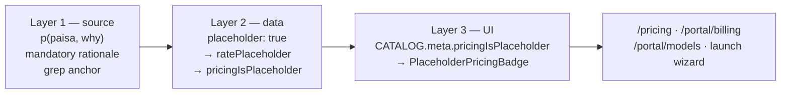
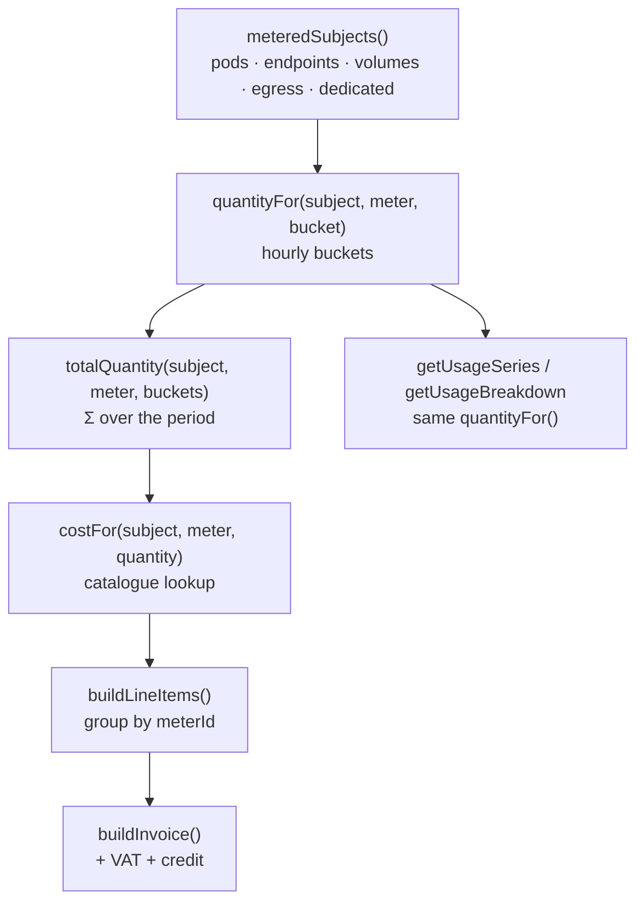

# 05 — Billing & Metering

**Owner:** Kaustuv · **Commercial approval:** unassigned — **blocking**

**Status:** ⚠️ **Partial**

| Sub-component | Status |
|---|---|
| Integer-paisa money arithmetic (`lib/money.ts`) | ✅ Implemented |
| Rate catalogue (`lib/catalog.ts`) | ⚠️ Implemented, **24 placeholder rates, no commercial approval** |
| Placeholder-pricing enforcement (3 layers) | ✅ Implemented |
| Meter definitions | ✅ Implemented (6 meters) |
| Usage derivation | ⚠️ Derived from a seeded PRNG at read time — **not a metering pipeline** |
| Invoice computation | ✅ Implemented — invoices reconcile with usage by construction |
| VAT (13 %), credit application, spend cap | ✅ Implemented |
| Payment execution | ❌ `payInvoice` mutates an in-memory `Set`. No rail is integrated. |
| Metering ingestion (OpenMeter/Lago-style) | ❌ Does not exist |

---

## 1. Money

### 1.1 The rule

**Money is integer paisa everywhere. 1 NPR = 100 paisa.** Floats are never used
for money.

```ts
export type Paisa = number;   // always an integer

/** Rupees -> paisa. Accepts fractional rupees (NPR 6.5 -> 650 paisa). */
export function NPR(rupees: number): Paisa {
  return Math.round(rupees * 100);
}
```

**Why this is not pedantry.** Per-second GPU metering aggregated over a month is
roughly 2.6 million additions (`3600 × 730`). IEEE-754 drift across that many
operations is measured in rupees, not paisa. Formatting happens only at the render
edge — `formatNpr`, `formatUsd`, `formatMoney` in `lib/money.ts` — and nothing
upstream of the render ever holds a fractional value.

### 1.2 VAT

```ts
export const VAT_RATE_PERCENT = 13;   // Nepal VAT

export function applyVat(subtotal: Paisa): { vat: Paisa; total: Paisa } {
  const vat = Math.round((subtotal * VAT_RATE_PERCENT) / 100);
  return { vat, total: subtotal + vat };
}
```

Rounded once, on the subtotal — not per line item. This matters: rounding each
line and summing produces a different total from rounding the sum.

### 1.3 USD is display-only

```ts
export const USD_DISPLAY = {
  nprPerUsd: 139.2,
  rateAsOf: "2026-09-01",
  disclaimer: "Indicative display conversion only. All charges settle in NPR.",
} as const;
```

Every USD figure in the product is indicative. The `rateAsOf` date and the
disclaimer must be rendered wherever USD appears. **All charges settle in NPR.**
There is no FX handling, no rate feed, and no settlement-rate concept — by design.

---

## 2. The rate catalogue

`lib/catalog.ts` is the single edit point for every rate in the platform.

### 2.1 ⚠ Placeholder pricing — the enforcement design

> Every rate in this file was invented for UI development. None of it has been
> through commercial approval.

Placeholder status is enforced in **three independent layers** so it cannot ship by
accident.



**Layer 1 — the `p()` marker.** Identity at runtime; a grep anchor and a mandatory
rationale at every call site.

```ts
function p(paisa: Paisa, why: string): Paisa {
  if (process.env.NODE_ENV !== "production" && !why) {
    throw new Error("a placeholder rate needs a rationale");
  }
  return paisa;
}
```

```bash
$ grep -c "p(NPR" lib/catalog.ts
24                      # rates still awaiting commercial approval
```

**Layer 2 — it reaches the data, not just the source.** Every rate object carries
`placeholder: true`, which propagates into `PodEstimate.ratePlaceholder`,
`InvoiceLineItem.ratePlaceholder` and `DedicatedQuote.pricingIsPlaceholder`. A
consumer of the API sees it, not just a reader of the file.

**Layer 3 — a visible badge.** `CATALOG.meta.pricingIsPlaceholder` drives
`PlaceholderPricingBadge`, rendered on every pricing surface. Removing the badge
means deleting a binding, which is a visible diff in review.

```tsx
export function PlaceholderPricingBadge({ className }: { className?: string }) {
  if (!CATALOG.meta.pricingIsPlaceholder) return null;
  return <span title={CATALOG.meta.notice}>… indicative pricing</span>;
}
```

**To go live:** replace the numbers, set `meta.pricingIsPlaceholder` to `false`,
and fill in `meta.reviewedAt`.

```ts
export const CATALOG = {
  meta: {
    pricingIsPlaceholder: true,          // ← flip only with approved rates
    currency: "NPR" as const,
    regionId: "np-ktm-1",
    vatRatePercent: VAT_RATE_PERCENT,
    usd: USD_DISPLAY,
    notice: "Rates shown are engineering placeholders pending commercial approval. Not for quoting.",
    reviewedAt: null as string | null,   // ← set on approval
  },
  // …
};
```

### 2.2 GPU hourly rates (13) — ⚠ placeholder

The rationale strings are part of the data. They record how each number was
derived, so a commercial reviewer can check the reasoning rather than just the
figure.

| Profile | NPR/h | Recorded rationale |
|---|---:|---|
| `h200-x1` | 415 | Anchored to ~USD 2.98/h H200 SXM at 139.2 NPR/USD |
| `h200-x8` | 3,180 | 8× h200 less ~4 % whole-node discount |
| `h100-x1` | 315 | Anchored to ~USD 2.26/h H100 SXM |
| `h100-x8` | 2,420 | 8× h100 less ~4 % whole-node discount |
| `h200-1g.18gb` (MIG) | 72 | 1/7 of `h200-x1` (NPR 59.3) **+ 21 % partition overhead** |
| `h200-2g.35gb` (MIG) | 132 | 2/7 of `h200-x1` (NPR 118.6) + 11 % |
| `h200-3g.71gb` (MIG) | 232 | 3/7 (NPR 177.9) + 30 % — 3g strands a GPC |
| `h200-7g.141gb` (MIG) | 405 | Full-card MIG, ~2.4 % under exclusive (no NVLink peer) |
| `h200-hami-10` (HAMi) | 47 | 10 % of `h200-x1` + 13 % scheduler overhead |
| `h200-hami-25` (HAMi) | 118 | 25 % of `h200-x1` + 14 %; **under MIG 2g, no isolation** |
| `h200-hami-50` (HAMi) | 220 | 50 % of `h200-x1` (NPR 207.5) + 6 % |

**The pricing model encodes the product distinction.** MIG is priced *above* the
linear fraction because partitioning strands capacity. HAMi is priced *below* the
comparable MIG tier because tenants are not fault-isolated. Collapsing MIG and
HAMi into one "slice" concept destroys both the product story and the pricing
logic — see [04 §3.2](04-data-model-and-api-contract.md#32-hardware-and-slicing).

### 2.3 Derived per-second rate

```ts
const hourly = (profileId, skuId, paisaPerHour): HourlyRate => ({
  profileId, skuId,
  meterId: "gpu_seconds",
  paisaPerHour,
  paisaPerSecond: paisaPerHour / 3600,   // derived, never stated separately
  minimumBillableSeconds: 60,
  placeholder: true,
});
```

The per-second rate is derived from the hourly rate, so the number shown to the
customer and the number used by the meter cannot drift. Minimum billable duration
is 60 seconds on every profile.

### 2.4 Other rate tables — ⚠ all placeholder

**JupyterHub** (per user-hour, metered per second while a server runs):

| Spawner profile | NPR/h | Rationale |
|---|---:|---|
| `jhub-cpu` | 9 | 4 vCPU / 16 GB, no GPU |
| `jhub-1g` (`h200-1g.18gb`) | 84 | MIG 1g.18gb (NPR 72) + NPR 12 hub/storage/culler |
| `jhub-2g` (`h200-2g.35gb`) | 146 | MIG 2g.35gb (NPR 132) + NPR 14 hub overhead |

**Model endpoints** (NPR per million tokens):

| Endpoint | Input | Output | Cached input |
|---|---:|---:|---:|
| `llama-3.3-70b-instruct` | 34 | 102 | 17 |
| `qwen2.5-72b-instruct` | 36 | 108 | 18 |
| `deepseek-v3` | 42 | 126 | 21 |
| `mistral-small-3.1-24b` | 9 | 27 | 4.5 |

Output is priced 3× input throughout; cached input at 50 % of input.
`cachedInputPaisaPerMillion` is `null` when the engine does not cache.

**Dedicated nodes** (NPR per month):

| Node | NPR/month | Rationale |
|---|---:|---|
| `node-h200-8x` (bare metal) | 2,150,000 | ~30 % under 730 h at the on-demand 8× rate |
| `node-h100-8x` (bare metal) | 1,620,000 | ~31 % under 730 h at the on-demand 8× rate |
| `node-h200-4x` (VM) | 1,120,000 | Half node; +4 % per GPU for hypervisor overhead |

**Term discounts:** `on-demand-monthly` 0 % · `reserved-6mo` 12 % ·
`reserved-12mo` 22 % · `reserved-36mo` 34 %.

**Storage and egress:**

| Item | Rate | Note |
|---|---:|---|
| `network-ssd` | NPR 11 / GB-month | Replicated, survives pod termination, mountable across pods |
| `nvme-local` | NPR 4 / GB-month | Ephemeral node-local scratch, cleared when the pod stops |
| Egress | NPR 6.50 / GB | 500 GB/month free; ingress and intra-region free |

### 2.5 Catalogue lookups fail loud

```ts
export function rateForProfile(profileId: string): HourlyRate { … throw … }
export function rateForEndpoint(endpointId: string): TokenRate { … throw … }
export function skuById(id: GpuModelId): GpuSku { … throw … }
export function profileById(id: string): SliceProfile { … throw … }
```

Every lookup throws on an unknown ID rather than returning a default. A default
rate would price a workload at zero and silently under-bill. Adding a
`SliceProfile` without a matching `HourlyRate` produces
`no catalog rate for profile <id>` at first use — the intended behaviour.

---

## 3. Meters

Six meters, defined as a closed union so an unknown meter is a compile error:

```ts
export type MeterId =
  | "gpu_seconds" | "tokens_in" | "tokens_out"
  | "storage_gb_hours" | "egress_gb" | "dedicated_months";

export interface Meter {
  id: MeterId;
  displayName: string;
  unit: string;
  aggregation: "sum" | "max" | "last";
  description: string;
}
```

| Meter | Unit | Priced from |
|---|---|---|
| `gpu_seconds` | seconds | `rateForProfile(pod.profileId).paisaPerSecond × gpuCount` |
| `tokens_in` | tokens | `TOKEN_RATES[endpoint].inputPaisaPerMillion / 1e6` |
| `tokens_out` | tokens | `TOKEN_RATES[endpoint].outputPaisaPerMillion / 1e6` |
| `storage_gb_hours` | GB-hours | `STORAGE_RATES["network-ssd"].paisaPerGbMonth / 730` |
| `egress_gb` | GB | `CATALOG.egress.paisaPerGb` |
| `dedicated_months` | months | `DEDICATED_NODES[0].monthlyPaisa` |

### 3.1 ❌ There is no metering pipeline

Usage is **derived at read time** from a deterministic generator, not ingested from
meter events. `lib/api/synthetic.ts`:

```ts
/**
 * Smooth pseudo-random value in [0,1] for a (subject, meter, bucket) triple.
 * Layered sine waves plus seeded jitter give a series that looks like real
 * telemetry — diurnal shape, not white noise — while staying reproducible.
 */
export function usageAt(subjectId: string, meterId: string, bucketIndex: number): number {
  const seed = hashSeed(`${subjectId}:${meterId}`);
  const phase = (seed % 1000) / 1000;
  const diurnal = 0.5 + 0.34 * Math.sin((bucketIndex / 24) * Math.PI * 2 + phase * 6.28);
  const weekly  = 0.08 * Math.sin((bucketIndex / 168) * Math.PI * 2 + phase * 3.14);
  const jitter  = (makeRng(seed + bucketIndex)() - 0.5) * 0.12;
  return Math.min(1, Math.max(0.02, diurnal + weekly + jitter));
}
```

The bucket is one hour. `quantityFor()` scales the `[0,1]` value into meter units:

| Meter | Full-scale quantity per hour |
|---|---|
| `gpu_seconds` | 3,600 |
| `tokens_in` | 420,000 |
| `tokens_out` | 140,000 |
| `storage_gb_hours` | 1,800 |
| `egress_gb` | 22 |
| `dedicated_months` | 1 (constant) |

Determinism is required for correctness of the *UI*, not the billing: a server
render and the client hydration must agree, and a usage chart must not change
shape on re-render.

---

## 4. Invoice derivation

**Invoices are computed from usage, not stored independently.** This is the central
design decision in the billing layer: billing always reconciles with the usage
screens because both read the same function.



### 4.1 Metered subjects

```ts
function meteredSubjects() {
  // every pod except `queued`      → gpu_seconds
  // every model endpoint           → tokens_in AND tokens_out
  // vol_datasets                   → storage_gb_hours
  // egress_region                  → egress_gb
  // every dedicated node           → dedicated_months
}
```

Queued pods are excluded — billing starts when a pod is scheduled, not when it is
requested.

### 4.2 Period bounds

The billing period is a **calendar month in UTC**:

```ts
function hoursThisPeriod(): number {
  const d = new Date(now());
  return (d.getUTCDate() - 1) * 24 + d.getUTCHours() + 1;
}

function periodBounds(): { start: string; end: string } {
  const d = new Date(now());
  const start = new Date(Date.UTC(d.getUTCFullYear(), d.getUTCMonth(), 1));
  const end   = new Date(Date.UTC(d.getUTCFullYear(), d.getUTCMonth() + 1, 0, 23, 59, 59));
  return { start: start.toISOString(), end: end.toISOString() };
}
```

A draft invoice sums `hoursThisPeriod()` buckets; a closed invoice sums 730.

⚠ **UTC, not Nepal time (UTC+05:45).** For a platform billing in NPR under Nepali
VAT, the period boundary almost certainly needs to be Asia/Kathmandu. This is an
open question, not a settled decision.

### 4.3 Line items

Line items are grouped by meter, not by subject:

```ts
function buildLineItems(buckets: number): InvoiceLineItem[] {
  const byMeter = new Map<MeterId, InvoiceLineItem>();
  for (const s of meteredSubjects()) {
    const qty  = totalQuantity(s.id, s.meterId, buckets);
    const cost = costFor(s.id, s.meterId, qty);
    const existing = byMeter.get(s.meterId);
    if (existing) {
      existing.quantity   += qty;
      existing.amountPaisa += cost;
    } else {
      byMeter.set(s.meterId, {
        id: `li_${s.meterId}`,
        meterId: s.meterId,
        description: meter.displayName,
        quantity: qty,
        unit: meter.unit,
        unitPricePaisa: qty > 0 ? Math.round(cost / qty) : 0,
        amountPaisa: cost,
        ratePlaceholder: true,
      });
    }
  }
  return [...byMeter.values()].filter((li) => li.amountPaisa > 0);
}
```

`unitPricePaisa` is a **display-only blended average** (`cost / qty`), recomputed
from the already-correct totals. It is never used to compute anything — pods on
different profiles have different rates, so a single unit price for the
`gpu_seconds` line is informational only.

### 4.4 Totals

```ts
const subtotal = lineItems.reduce((a, li) => a + li.amountPaisa, 0);
const { vat, total } = applyVat(subtotal);
const credit = monthsAgo === 0 ? Math.min(store.org.creditBalancePaisa, total) : 0;
// …
totalPaisa: total - credit,
pricingIsPlaceholder: CATALOG.meta.pricingIsPlaceholder,
```

Order of operations: **subtotal → VAT → credit**. Credit is applied to the
VAT-inclusive total and clamped to it, so a credit balance larger than the invoice
cannot produce a negative total. Credit applies only to the current draft.

Invoice numbering is `CV-{YYYY}-{MM}` from the period start. Due date is
period end + 15 days; a paid invoice records `paidAt` at period end + 9 days.

### 4.5 Current spend

`getCurrentSpend()` returns `CurrentSpend`, including a **straight-line
extrapolation** to period end:

```ts
export interface CurrentSpend {
  periodStart: string;  periodEnd: string;
  subtotalPaisa: Paisa;  vatPaisa: Paisa;  totalPaisa: Paisa;
  creditAppliedPaisa: Paisa;
  spendCapPaisa: Paisa | null;
  projectedTotalPaisa: Paisa;      // straight-line to period end
  pricingIsPlaceholder: boolean;
}
```

A straight-line projection is naive by construction and is labelled "projected" in
the UI rather than presented as a forecast.

---

## 5. Spend controls

| Control | Method | Implementation |
|---|---|---|
| Spend cap | `setSpendCap(paisa \| null)` | Stored on `Organization`; `null` = uncapped |
| Credit balance | `addCredit(paisa)` | Applied to the current draft, clamped to the total |
| Payment | `payInvoice(id, paymentMethodId)` | ⚠ Adds the id to an in-memory `Set<string>` |

❌ **The spend cap is displayed, not enforced.** Nothing in `launchPod()` or any
other mutation checks `spendCapPaisa`. A real control plane must enforce it at
admission time.

❌ **No payment rail is integrated.** `PaymentRail` models `esewa`, `khalti`,
`bank-transfer` and `corporate-invoice`; `listPaymentMethods()` returns fixtures.
`payInvoice()` performs no transaction.

---

## 6. Reconciliation guarantee

Because usage screens and invoices both call `quantityFor()` and `costFor()`, they
cannot disagree. This is worth preserving when a real pipeline lands:

| Screen | Call path |
|---|---|
| `/portal/usage` — series | `getUsageSeries()` → `quantityFor()` |
| `/portal/usage` — breakdown | `getUsageBreakdown()` → `quantityFor()` + `costFor()` |
| `/portal/billing` — current spend | `getCurrentSpend()` → `buildInvoice()` → same |
| `/portal/billing` — draft invoice | `getDraftInvoice()` → `buildInvoice()` → same |
| `/portal` — GPU hours tile | `getUsageSeries({ meterIds: ["gpu_seconds"] })` |

**Design requirement for the real implementation:** the invoice must be a
projection over the same event store the usage screens read, not a parallel
calculation. Two code paths computing money from the same events will diverge.

---

## 7. Work remaining

| # | Item | Blocking |
|---|---|---|
| 1 | **Commercial approval of all 24 rates** | Public launch |
| 2 | Metering ingestion — event schema, idempotency, late-arrival handling | Real billing |
| 3 | Event store with tenant + subject dimensions | Real billing |
| 4 | Decide the billing period timezone (UTC vs Asia/Kathmandu) | Invoice correctness |
| 5 | Enforce the spend cap at pod admission | Revenue risk |
| 6 | Integrate eSewa / Khalti / bank transfer | Collections |
| 7 | Invoice PDF generation with PAN number and VAT breakdown | Nepali tax compliance |
| 8 | Credit ledger (currently a single balance field, no history) | Auditability |
| 9 | Proration for mid-period plan or term changes | Dedicated nodes |
| 10 | Reconciliation job comparing meter totals to invoiced totals | Assurance |
