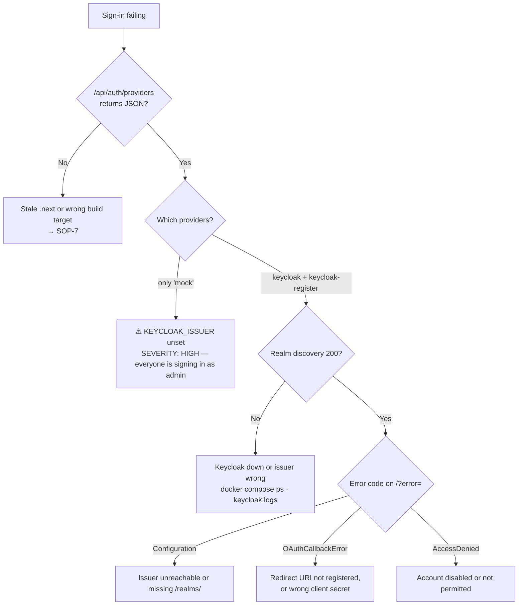

# 08 — Operations Runbook

**Owner:** Kaustuv · **Support:** Abhigyan

**Status:** ⚠️ **Partial** — operational procedures for the local/beta stack are
complete and verified. There is **no production deployment**, no telemetry stack,
no alerting and no on-call rotation.

---

## 1. Service inventory

| Service | Process / container | Port | Health probe | Owner |
|---|---|---|---|---|
| Next.js app | `next dev` / `next start` | 3000 | `GET /` (no dedicated endpoint) | Kaustuv |
| Keycloak | `cv-keycloak` | 8080 (app), 9000 (management) | `GET :9000/health/ready` | Kaustuv |
| PostgreSQL | `cv-keycloak-db` | 5432 (internal only) | `pg_isready -U keycloak` | Kaustuv |

---

## 2. Health checks

### 2.1 Full stack, one pass

```bash
# App
curl -s -o /dev/null -w "app:            %{http_code}\n"  http://localhost:3000/
curl -s -o /dev/null -w "route guard:    %{http_code}\n"  http://localhost:3000/portal   # expect 302
curl -s http://localhost:3000/api/auth/providers | head -c 120; echo

# Keycloak
curl -s -o /dev/null -w "realm:          %{http_code}\n" \
  http://localhost:8080/realms/corevalley/.well-known/openid-configuration

# Containers
docker compose ps --format "table {{.Service}}\t{{.Status}}"
```

Expected:

```
app:            200
route guard:    302
{"keycloak":{"id":"keycloak","name":"Keycloak","type":"oidc", …
realm:          200
SERVICE    STATUS
keycloak   Up 21 seconds (healthy)
postgres   Up 10 minutes (healthy)
```

### 2.2 Keycloak health — port 9000, not 8080

Keycloak 25 serves health on a **separate management listener**.
`GET :8080/health/ready` returns `404`.

```bash
$ docker exec cv-keycloak bash -c 'exec 3<>/dev/tcp/127.0.0.1/9000 && \
    printf "GET /health/ready HTTP/1.0\r\n\r\n" >&3 && cat <&3' | head -3
HTTP/1.1 200 OK
content-type: application/json; charset=UTF-8
{"status": "UP", …}
```

The compose healthcheck uses this, because the image ships neither `curl` nor
`wget`:

```yaml
healthcheck:
  test:
    - CMD
    - bash
    - -c
    - >-
      exec 3<>/dev/tcp/127.0.0.1/9000 &&
      printf 'GET /health/ready HTTP/1.0\r\n\r\n' >&3 &&
      grep -q '"status": "UP"' <&3
  interval: 10s
  timeout: 5s
  retries: 20
  start_period: 40s
```

The folded block scalar (`>-`) is required. A double-quoted YAML string converts
`\r\n` into real newlines and breaks the request.

### 2.3 ❌ Missing probes

| Missing | Consequence |
|---|---|
| `/healthz` (liveness) | A load balancer must probe `/`, which renders the full homepage |
| `/readyz` (readiness) | No way to gate traffic during startup |
| Dependency check (Keycloak reachable) | The app starts happily with an unreachable IdP and fails at first sign-in |
| Build/version endpoint | No way to confirm which commit is deployed |

---

## 3. Telemetry

❌ **There is no telemetry stack.** No structured logging, no metrics exporter, no
distributed tracing, no RUM, no error reporting, no log aggregation, no alerting.

### 3.1 Signals that do exist

| Signal | Source | Retention | Structured? |
|---|---|---|---|
| HTTP request log | stdout of `next dev` / `next start` | Process lifetime | No |
| Build report | `npm run build` | Per build | No |
| Keycloak server log | `docker compose logs keycloak` | Container lifetime | Partially (JBoss format) |
| Keycloak login/admin events | Admin console → Events | Realm-configured | Yes |
| Container health history | `docker inspect --format='{{json .State.Health.Log}}' cv-keycloak` | Last 5 probes | Yes |
| Browser errors | DevTools console | Session | No |

### 3.2 Reading the audit signal

The console has an audit log at `/portal/audit`, backed by
`listAuditLog()` / `verifyAuditChain()` / `exportAuditLog()`. ⚠ **It is generated
demo data**, not a record of real activity — 60 synthetic entries built by
`buildAuditLog(60)`. Do not use it for incident reconstruction.

### 3.3 Minimum viable telemetry

❌ PROPOSED. Priority order for the first production deployment:

1. **Structured request logging** with a request ID, propagated to the browser via
   a response header, so a user report can be tied to a server log line.
2. **Error reporting** (Sentry or equivalent) wired into `app/error.tsx` and the
   `NotImplementedError` path.
3. **Auth event metrics** — sign-in success/failure, refresh failure rate
   (`RefreshAccessTokenError`), federated-logout failures. All three are silent
   today; `refreshAccessToken()` swallows its exception by design.
4. **Keycloak metrics** — `KC_METRICS_ENABLED: "true"` is already set in
   `docker-compose.yml`, exposing Micrometer metrics on port 9000. Nothing scrapes
   them.

---

## 4. Standard operating procedures

### SOP-1 — Start the local stack

```bash
npm run keycloak:up
for i in $(seq 1 30); do
  s=$(docker inspect --format='{{.State.Health.Status}}' cv-keycloak 2>/dev/null)
  [ "$s" = "healthy" ] && break; sleep 5
done
echo "keycloak: $s"
npm run dev
```

### SOP-2 — Stop the local stack

```bash
# Ctrl-C the dev server, then verify the child process actually exited:
#   Windows: Get-NetTCPConnection -State Listen -LocalPort 3000
#   Unix:    lsof -i :3000
npm run keycloak:down     # keeps data
```

### SOP-3 — Reset the realm to the committed definition

Use when `keycloak/corevalley-realm.json` has been edited. The import strategy is
`IGNORE_EXISTING`, so an edit has **no effect** without this.

```bash
npm run keycloak:reset    # docker compose down -v && docker compose up -d
```

⚠ Destroys the volume. All users created in the admin console are lost.

### SOP-4 — Persist an admin-console change

Console changes live in PostgreSQL, not the JSON, and are lost on SOP-3.

1. Admin console → Realm settings → Action → **Partial export** (include clients
   and groups/roles).
2. Replace `keycloak/corevalley-realm.json`.
3. Re-add the seeded users and credentials — Keycloak does **not** export
   passwords.
4. Verify with SOP-3 followed by SOP-6.

### SOP-5 — Add a beta tester

1. Admin console → realm `corevalley` → Users → **Add user** (email as username).
2. Credentials tab → set password, **Temporary: off**.
3. Role mapping tab → assign `admin` if required. `member` is granted
   automatically via `default-roles-corevalley`.
4. Attributes tab → set `org`.

Alternatively, direct the tester to the sign-up flow — `registrationAllowed: true`.

### SOP-6 — Verify the full auth flow

The end-to-end script is in
[`../KeyCloak_Readme.md` §13](../KeyCloak_Readme.md). It exercises CSRF →
authorize → Keycloak login form → callback → session → `/portal`, with no browser.

Expected tail:

```
lands on: http://localhost:3000/portal/pods
{"user":{…,"role":"admin","org":"CoreValley"}, …}
```

### SOP-7 — Recover from a split-brain `.next`

```bash
# stop every dev/prod server first
rm -rf .next
npm run dev     # or: npm run build && npm start
```

### SOP-8 — Rotate the Keycloak client secret

1. Admin console → Clients → `corevalley-portal` → Credentials → **Regenerate**.
2. Update `KEYCLOAK_CLIENT_SECRET` in the environment.
3. Restart the app. Existing sessions survive (the session JWT is app-signed), but
   **token refresh will fail** for sessions mid-flight until they re-authenticate.

---

## 5. Incident playbooks

### IR-1 — "Nobody can sign in"



### IR-2 — "Signed out, but signing back in needs no password"

Federated logout failed. The Keycloak SSO cookie survived.

1. Confirm `isKeycloakEnabled` — mock mode has no federated logout by design.
2. Confirm `token.idToken` is present; without it the `signOut` event returns early.
3. Check the realm's post-logout redirect URIs.
4. Reproduce: sign out, then re-issue the authorization request with the Keycloak
   cookie jar. A **200** (login form) means logout worked; a **302** straight to
   the callback means it did not.

### IR-3 — "Portal shows stale or wrong data"

1. **Expected if the process restarted.** The mock store is in-memory and
   per-process.
2. **Check the build output.** Every `/portal` route currently prerenders as
   `○ (Static)` — see [07 §3](07-build-deploy-and-environments.md). With a real
   backend this serves build-time data to every tenant. **Severity: critical** once
   `NEXT_PUBLIC_API_MODE=http` is in use.
3. Confirm `NEXT_PUBLIC_API_MODE` is what you think it is; it is inlined at build
   time, so changing it requires a rebuild.

### IR-4 — "Keycloak container is unhealthy but the app works"

Almost certainly a probe problem, not a service problem. Confirm:

```bash
docker inspect --format='{{json .State.Health.Log}}' cv-keycloak | head -c 400
curl -s -o /dev/null -w "%{http_code}\n" \
  http://localhost:8080/realms/corevalley/.well-known/openid-configuration
```

`200` from the realm endpoint with a failing healthcheck means the probe is wrong
— historically, probing `/health/ready` on 8080 instead of 9000.

### IR-5 — "Pod stuck in queued"

`scheduleLaunch()` timers live in the Node process. A restart or an HMR module
reload loses them, and the pod never leaves `queued`. Restart the dev server and
relaunch. Not applicable once a real scheduler exists.

---

## 6. Troubleshooting index

| Symptom | Cause | Fix |
|---|---|---|
| `ENOENT … route.js` under `.next/server/app/api/auth` | Static-export `.next` reused by the dev server | SOP-7 |
| `/api/auth/*` returns the 404 page | Same, or `NEXT_STATIC_EXPORT` still exported | Unset it, SOP-7 |
| Sign-in always lands on `/` | Relative `callbackUrl` — Auth.js discards it | Pass an absolute URL |
| `invalid_request: Missing parameter: code_challenge_method` | Authorization URL built by hand without PKCE | Let Auth.js build it |
| `error=OAuthCallbackError` | Redirect URI unregistered or wrong client secret | Compare Clients → Credentials with `.env.local` |
| `error=Configuration` | `KEYCLOAK_ISSUER` unreachable or missing the realm path | Must end `/realms/corevalley` |
| Keycloak stuck `unhealthy` | Probing 8080 instead of 9000 | See §2.2 |
| Realm JSON edits have no effect | Import strategy `IGNORE_EXISTING` | SOP-3 |
| `session.user.role` is a type error | `types/next-auth.d.ts` not in `tsconfig` `include` | It matches `**/*.ts` — check for an `exclude` |
| `org` is a domain, not the organisation | User has no `org` attribute | Set it; the fallback is the email domain |
| Portal shows "Account", no name | `useSession()` empty — missing `<AuthProvider>` | Mounted in `app/layout.tsx` |
| `NotImplementedError: … getCurrentUser()` | `NEXT_PUBLIC_API_MODE=http` with no backend | Unset it |
| `no catalog rate for profile <id>` | A `SliceProfile` with no matching `HourlyRate` | Add it to `GPU_HOURLY` |
| Hydration mismatch warning | Non-deterministic render | Use `now()` / `usageAt()` from `lib/api/synthetic.ts` |
| `Cannot find module './NNN.js'` | Build ran alongside a running server | SOP-7 |
| Dev server on port 3002 | Port 3000 held by an orphaned `next` process | Kill it; the fallback port breaks redirect URIs |

---

## 7. Release verification

Run before merging to `main`. There is **no automated equivalent** — see
[07 §5](07-build-deploy-and-environments.md).

```bash
npm run typecheck
npm run lint
rm -rf .next && npm run build                     # server target
NEXT_PUBLIC_API_MODE=http npx next build          # interface-swap check
rm -rf .next && NEXT_STATIC_EXPORT=true npm run build   # static target
```

Then assert:

| Check | Expected |
|---|---|
| Server build route table | `/api/auth/[...nextauth]` present and `ƒ (Dynamic)` |
| Server build middleware | `ƒ Middleware` present |
| Static build | `out/api` does not exist |
| Marketing routes | `○ (Static)` |
| Portal routes | ⚠ **should be `ƒ (Dynamic)` — currently `○ (Static)`.** Known defect, [07 §3](07-build-deploy-and-environments.md) |
| Placeholder pricing | `grep -c "p(NPR" lib/catalog.ts` = 24, and `CATALOG.meta.pricingIsPlaceholder` is `true` until commercially approved |
| Auth flow | SOP-6 passes |

---

## 8. Backup and recovery

| Data | Where | Backup | Recovery |
|---|---|---|---|
| Keycloak realm definition | `keycloak/corevalley-realm.json` (git) | Git | SOP-3 |
| Keycloak runtime state (users, sessions) | Docker volume `kc-pgdata` | ❌ **None** | ❌ None — SOP-3 recreates only the seeded users |
| Portal domain data | In-memory | N/A | Recreated on start |
| Application source | Git | GitHub | `git clone` |

❌ **There is no backup of the Keycloak database.** Any user created through the
admin console or self-registration exists only in a local Docker volume. This is
acceptable for beta testing on one machine and is not acceptable for anything else.

---

## 9. Escalation

| Class | First responder | Escalate to |
|---|---|---|
| Portal frontend, build, deploy | Abhigyan | Kaustuv |
| Auth, Keycloak, identity | Kaustuv | — |
| Billing / catalogue data | Kaustuv | Commercial (unassigned) |
| Anything touching customer data | Kaustuv | — |

❌ No on-call rotation, no paging, no incident tracker, no SLA. All escalation is
by direct contact.
