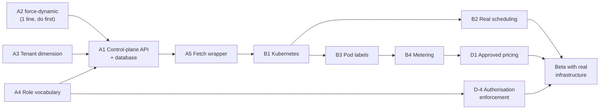

# 10 — Implementation Status

**Owner:** Kaustuv
**Last verified:** against the working tree at the time of writing, by building
both targets, running lint, and exercising the auth stack end to end.

This is the authoritative as-built register. Where any other document in this wiki
disagrees with this page, this page is correct.

---

## 1. Component status

Legend: ✅ implemented · ⚠️ partial · ❌ absent

### Web Portal & Customer Control Plane

| Component | Status | Evidence |
|---|---|---|
| Marketing site — 9 routes | ✅ | Build output; all `○ (Static)` |
| Console — 15 routes | ✅ | Build output |
| Design-system bridge | ✅ | `app/globals.css`; 11 primitives, 9 server / 2 client |
| Service-layer contract | ✅ | `CoreValleyClient`, 71 methods, `satisfies` on both implementations |
| Mock data implementation | ✅ | `lib/api/mock.ts`, ~52 KB |
| Pod launch wizard + live panel | ✅ | Verified in-app; `setTimeout` state machine |
| Usage / billing screens | ✅ | Invoices computed from usage, reconcile by construction |
| **Control-plane API** | ❌ | `lib/api/http.ts` — 71 stubs, all throw |
| **Domain database** | ❌ | No DDL, no migrations, no persistence |
| **Status page** | ❌ | No route, no component, no integration |
| **Support desk** | ⚠️ | Sales enquiry form → FormSubmit relay. No ticketing, no SLA, no authenticated channel. |
| **Authorisation enforcement** | ❌ | `role` mapped and typed; never checked |
| **Tenant isolation** | ❌ | One `Organization` fixture; no tenant dimension anywhere |

### Keycloak Authentication & Identity

| Component | Status | Evidence |
|---|---|---|
| OIDC authorization-code flow + PKCE | ✅ | Full flow driven end to end; session returned with `role`/`org` |
| Realm, client, mappers, roles, users | ✅ | `Realm 'corevalley' imported`; claims verified in ID token **and** userinfo |
| Declarative user profile (`org`) | ✅ | `org` renders on the registration form |
| Self-registration entry point | ✅ | `/registrations` authorization URL with PKCE |
| Claim → session mapping | ✅ | `role=admin`, `org=CoreValley`, `id` = Keycloak `sub` |
| Route protection (`/portal/*`) | ✅ | `302 → /?signin=1&callbackUrl=%2Fportal` |
| Access-token refresh | ✅ | Implemented; rotation-safe |
| Federated logout | ✅ | Re-authorize renders the login form — SSO session terminated |
| Mock mode | ✅ | Only `mock` registered; identical session shape |
| Static-demo mode | ✅ | Baked session; `out/api` absent |
| **Multi-tenant realm provisioning** | ❌ | One shared realm; no Admin API client |
| **JupyterHub authenticator** | ❌ | No JupyterHub |
| **LiteLLM JWT validation** | ❌ | No gateway; API keys are opaque strings from the mock |
| **vCluster Kubernetes OIDC** | ❌ | No Kubernetes |
| **Keycloak role → K8s RBAC** | ❌ | No manifests; realm emits `realm_access.roles`, not `groups` |
| **Tenant metadata in pod labels** | ❌ | Pods are in-memory objects; `Pod` has no tenant field |
| **MFA** | ❌ | Not enabled |
| **SMTP / email verification** | ❌ | Not configured |

### Billing & Metering

| Component | Status |
|---|---|
| Integer-paisa arithmetic, VAT, USD display | ✅ |
| Rate catalogue (13 GPU + 3 Jupyter + 4 token + 3 dedicated + storage + egress) | ⚠️ **24 placeholder rates, no commercial approval** |
| Three-layer placeholder enforcement | ✅ |
| Meter definitions (6) | ✅ |
| Usage derivation | ⚠️ PRNG at read time, not a metering pipeline |
| Invoice computation, credit, spend-cap display | ✅ |
| **Spend-cap enforcement** | ❌ Displayed only; no admission check |
| **Payment rails (eSewa, Khalti, bank)** | ❌ `payInvoice` mutates an in-memory `Set` |
| **Metering ingestion / event store** | ❌ |
| **Invoice PDF with PAN and VAT breakdown** | ❌ |

### Platform / delivery

| Component | Status |
|---|---|
| Dual build targets, both verified | ✅ |
| GitHub Pages deployment | ✅ |
| Lint clean | ✅ |
| **CI lint / typecheck / server build** | ❌ Only the Pages build runs |
| **Automated tests** | ❌ No runner, no test files |
| **Telemetry, logging, tracing, alerting** | ❌ |
| **Health endpoints** (`/healthz`, `/readyz`) | ❌ |
| **Container image for the app** | ❌ No `Dockerfile` |
| **Keycloak database backups** | ❌ |

---

## 2. Defect register

Ordered by severity. These are defects in **existing** code, distinct from
unbuilt features.

| ID | Severity | Defect | Location | Impact |
|---|---|---|---|---|
| **D-1** | 🔴 Critical (latent) | Portal routes prerender as `○ (Static)`; no route exports `dynamic` | `app/(portal)/portal/layout.tsx` | With a real backend, every tenant is served build-time data. The repo README states the invariant that is currently violated. Also: `generateStaticParams()` hard-codes six pod IDs. |
| **D-2** | 🔴 Critical (config) | Unset `KEYCLOAK_ISSUER` silently enables mock mode — everyone signs in as `admin`, with a committed signing secret | `lib/auth.ts` | Full authentication bypass in a misconfigured deployment |
| **D-3** | 🟠 High | Two role vocabularies that do not match: `admin \| member` (auth) vs `owner \| admin \| engineer \| billing \| viewer` (domain). No mapping exists. | `types/next-auth.d.ts` vs `lib/api/types.ts` | Any authorisation work must resolve this first |
| **D-4** | 🟠 High | `role` is never checked | Everywhere | No privilege separation |
| **D-5** | 🟡 Medium | `Pod` has no organisation/tenant field; attribution stops at `projectId` | `lib/api/types.ts` | Blocks metering attribution and pod labelling |
| **D-6** | 🟡 Medium | Billing period boundary is UTC, not Asia/Kathmandu | `lib/api/mock.ts` `periodBounds()` | Wrong invoice boundaries for a Nepal-billed product |
| **D-7** | 🟡 Medium | Spend cap displayed but not enforced | `lib/api/mock.ts` | Revenue risk once real |
| **D-8** | 🟡 Medium | Audit chain hash is FNV-1a, not cryptographic | `lib/api/synthetic.ts` | No tamper resistance |
| **D-9** | 🟡 Medium | `session.accessToken` is browser-readable, with no CSP | `lib/auth.ts` | Inert today; real once an API accepts it |
| **D-10** | 🟢 Low | Single-flight refresh not implemented | `lib/auth.ts` | Breaks if refresh-token rotation is enabled |
| **D-11** | 🟢 Low | `headers()` in `next.config.ts` is ignored by the static export | `next.config.ts` | `/brand/*` cache headers absent on Pages |
| **D-12** | 🟢 Low | README states "No authentication" and "`output` is unset" — both now stale | `README.md` | Corrected in the Authentication section; the blocker table has been updated |

---

## 3. Gap register — unbuilt work

Grouped by what unblocks what. **Nothing in Group B can start before Group A.**

### Group A — foundations

| # | Item | Unblocks |
|---|---|---|
| A1 | Control-plane API service + domain database | Everything |
| A2 | Add `force-dynamic` to the portal layout (**D-1**) | A1 — must land first |
| A3 | Add the tenant dimension to the domain model (**D-5**) | Multi-tenancy, metering |
| A4 | Resolve the role vocabulary (**D-3**) | Authorisation, RBAC |
| A5 | Fetch wrapper in `http.ts` — auth header, error envelope, retries, request IDs | A1 |
| A6 | Error envelope + typed error union ([04 §5.3](04-data-model-and-api-contract.md)) | A1 |
| A7 | Idempotency keys on `launchPod`, `createVCluster`, `createApiKey`, `payInvoice` | A1 |

### Group B — platform integration

| # | Item | Depends on |
|---|---|---|
| B1 | Kubernetes / vCluster provisioning | A1, A3 |
| B2 | Pod scheduling replacing the `setTimeout` state machine | B1 |
| B3 | Tenant metadata in pod labels | A3, B1 |
| B4 | Metering ingestion + event store | B3 |
| B5 | JupyterHub deployment + `GenericOAuthenticator` | A1 |
| B6 | LiteLLM gateway + the opaque-key vs JWT decision ([03 §7.3](03-keycloak-identity.md)) | A1 |
| B7 | Kubernetes OIDC + `groups` mapper + RBAC bindings | A4, B1 |

### Group C — identity at scale

| # | Item | Depends on |
|---|---|---|
| C1 | Decide the tenancy model: realm-per-tenant vs group-per-tenant vs Organizations | A3 |
| C2 | Keycloak Admin API client + service account | A1, C1 |
| C3 | Automated realm/client/mapper/role provisioning | C2 |
| C4 | Tenant → issuer resolution (subdomain, path, or email-domain lookup) | C1 |
| C5 | Dynamic Auth.js provider construction per tenant | C4 |
| C6 | Invite flow wired to Keycloak (`inviteUser` exists but is mock-only) | C2 |
| C7 | MFA, SMTP, email verification | — (independent) |

### Group D — commercial and compliance

| # | Item | Blocking |
|---|---|---|
| D1 | **Commercial approval of 24 placeholder rates** | Public launch |
| D2 | Payment rail integration (eSewa, Khalti, bank transfer) | Collections |
| D3 | Invoice PDF with PAN and VAT breakdown | Nepali tax compliance |
| D4 | Billing period timezone decision (**D-6**) | Invoice correctness |
| D5 | Real audit events + cryptographic chain (**D-8**) | Compliance claims |
| D6 | Replace or contract the FormSubmit relay | Data residency claim |

### Group E — operational readiness

| # | Item |
|---|---|
| E1 | CI: lint, typecheck, server build, `NEXT_PUBLIC_API_MODE=http` build |
| E2 | Test suite (none exists) |
| E3 | Structured logging with request IDs; error reporting |
| E4 | Health endpoints |
| E5 | Metrics — auth failures, refresh failures, latency. Keycloak already exposes Micrometer on :9000; nothing scrapes it |
| E6 | Keycloak database backups |
| E7 | `Dockerfile` + deployment manifests |
| E8 | Security headers — CSP, HSTS, `X-Frame-Options`, `Referrer-Policy` |
| E9 | Dependency scanning; pin `next-auth` exactly (it is a beta on the auth path) |

---

## 4. Critical path to a usable beta with real infrastructure

**A2 is a one-line change and must land before any backend work**, because every
subsequent step is invisible while portal pages are prerendered at build time.

---

## 5. What is genuinely production-grade today

Stated so the gaps above are not read as "nothing works":

- The **OIDC integration** is correct: confidential client, PKCE, server-side token
  exchange, encrypted session, refresh with rotation tolerance, verified federated
  logout, open-redirect defence, fail-closed role derivation.
- The **service-layer contract** is a real specification. 71 methods, Promise-only,
  transport-agnostic subscriptions, compile-enforced parity between two
  implementations. A backend team can build against it without further design work.
- The **money layer** is correct: integer paisa end to end, VAT rounded once on the
  subtotal, per-second rates derived from hourly rates so display and meter cannot
  drift, USD strictly indicative with a dated rate and a disclaimer.
- The **placeholder-pricing enforcement** is a genuinely good control: three
  independent layers, a mandatory rationale at every rate literal, and a badge that
  cannot be removed without a visible diff.
- The **frontend** holds a hard determinism invariant (seeded PRNG, hour-quantised
  clock, absolute timestamps, fixed float precision) that keeps SSR and hydration
  byte-identical, and keeps 9 of 11 primitives on the server.
- The **build system** solves a real conflict — dynamic auth handler versus static
  export — with one source of truth and no conditionals in the handler.
